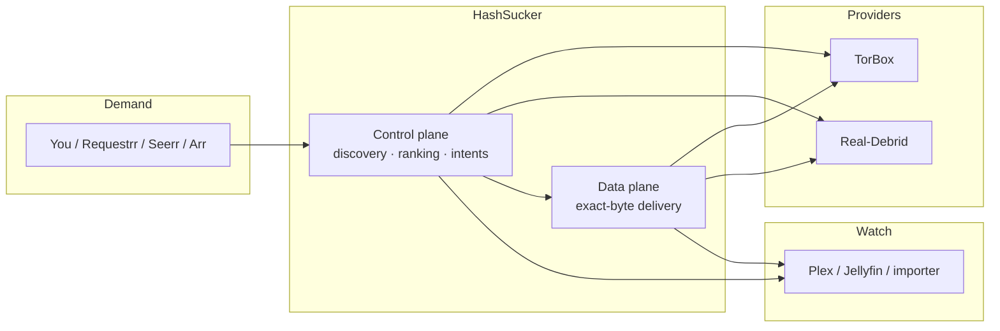

# HashSucker

**Give it media intent; it finds the best viable release, makes it playable, and keeps the lifecycle healthy automatically.**

HashSucker is a self-hosted media fulfillment layer for debrid-backed Plex/Jellyfin libraries. You request a movie or episode through tools you already use — it discovers releases, ranks them, binds the winner to TorBox and/or Real-Debrid, publishes a stable library entry, streams exact bytes, and then keeps watching: upgrading quality when better releases appear, adding provider redundancy when it matters, and retiring temporary items on its own.

No management UI by design. Not a media frontend, not a torrent browser, and not another Radarr/Sonarr replacement — those tools stay exactly where they are.

## What it does

- **Playback** — exact-byte ranged streaming with seek support, provider capability reuse, same-file provider failover, and dead-peer/cancellation handling that recovers without restarts.
- **Discovery** — a 1.5M-row release corpus that bootstraps itself on first install, plus live sourcing (Torrentio, Comet, Prowlarr, Torznab), merged on exact release identity with explained ranking.
- **Automation** — future-intent preparation from Sonarr/Radarr monitoring, quality-aware automatic upgrades (with a durability veto against fragile replacements), temporary watch-once publications with Plex-aware retention, cheap dual-provider enrichment, and storm-triggered redundancy escalation.
- **Lifecycle** — restart-safe downloads and promotions with bounded retries, a durable importer handoff for staged files, stale provider repair, invalid-fragment-tolerant corpus updates, and clean boot from empty state.

## How it works



Request → control plane resolves one exact media file → provider placements → published into Plex/Jellyfin paths (VFS/STRM) or staged for download → data plane serves bytes → background loops prepare upcoming demand, upgrade quality, enrich redundancy, and retire the temporary.

## Quick start

Packaged images, no source build. Latest stable release: **v0.2.0**.

```sh
cp .env.unraid.example .env   # or .env.example for the full reference
# edit: one provider key + two host paths (below)
docker compose pull
docker compose up -d
curl -s localhost:3000/api/diagnostics | head -c 300
```

Minimum config — at least one provider, nothing dummy for the other:

- `TORBOX_API_KEY` and/or `REALDEBRID_API_KEY`
- `HASHSUCKER_DATA_PATH` — persistent databases and state (back this up)
- `HASHSUCKER_MEDIA_PATH` — STRM/publication output, visible to Plex/Jellyfin
- `PUID`/`PGID` only if your host needs it (Unraid: `99`/`100`)

What to expect: containers start → diagnostics report `ready` within seconds → the corpus bootstraps in the background (requests work immediately) → rerequests complete in milliseconds → temporary items retire on their own.

## Works with

| Integration | Role | Status |
|---|---|---|
| TorBox | Provider: discovery, binding, serving | Core |
| Real-Debrid | Provider: discovery, binding, serving | Core (either provider alone works) |
| Plex | Library refresh, playback sessions (retention), STRM playback | Core |
| Jellyfin | Library refresh, STRM playback | Core |
| Sonarr / Radarr | Upcoming-monitored sensors (reads only, never downloads) | Optional |
| Prowlarr / Torznab | Extra release candidates | Optional |
| Seerr | Request webhooks, incl. deferred unavailable requests | Optional |
| Requestrr | Request source via download intents | Optional |

Absent integrations disable cleanly — nothing dummy required.

## Deployment

Docker + GHCR images (`latest` tracks stable releases, `main` is the dev channel, `v0.2.0` pins immutable). One compose file, one env template, one VFS mount unit. Fresh installs bootstrap from empty state; updates are atomic (`pull` + `up -d`, no manual migration, schema-safe rollback); restarts self-heal to playable in seconds with byte-identical media.

**Unraid is a first-class target:** Compose Manager, appdata/media share layout, `99:100` ownership, backup/restore procedure. See [`UNRAID.md`](UNRAID.md).

## Current limitations (honest)

- Debrid provider availability and rate limits can still create stalls; single-provider titles have less resilience until redundancy exists for them.
- Plex has richer consumption integration than Jellyfin today (sessions-based retention is Plex-only).
- Real-Debrid cache introspection is account-limited here, so uncached RD acquisition stays a deliberate storm-only action.
- Arm64 images build but are not field-proven.
- Provider-backed media is ephemeral by nature; HashSucker is not archival storage (permanent promotion aside).

## Docs for the curious

- [`docs/releases/v0.2.0.md`](docs/releases/v0.2.0.md) — what the current release improved.
- [`docs/architecture.md`](docs/architecture.md) — services, identity model, data model, HTTP surface.
- [`docs/operations.md`](docs/operations.md) — deployment, environment variables, health checks.
- [`UNRAID.md`](UNRAID.md) — Unraid Compose Manager quick-start, backup, restore, update.
