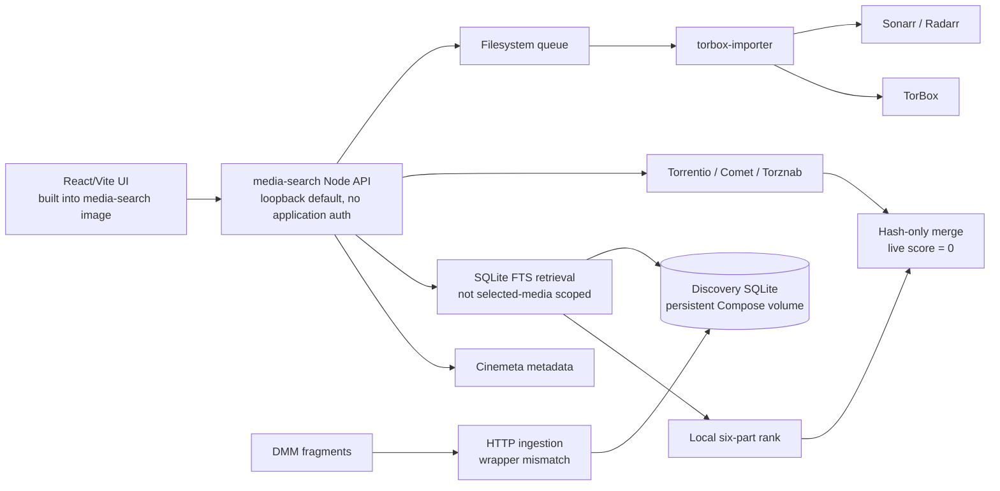
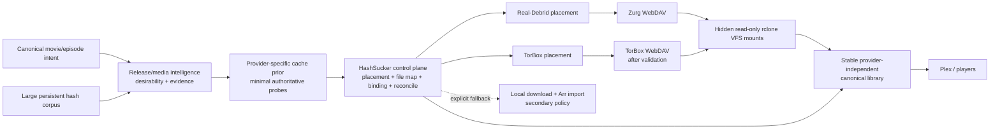

# Architecture

**Verified baseline:** 2026-08-21. This document deliberately separates current implementation from target architecture.

## System purpose

HashSucker is evolving from a discovery-plus-local-import prototype into a control plane that turns a large hash corpus into provider-backed, stable virtual-library items. It should decide what media and release are wanted, minimize costly provider checks, own placements and canonical bindings, and observe fulfillment health. Mature external systems should transport bytes.

## Current implementation



### Current components

- **`media-search`** owns metadata lookup, discovery storage, local retrieval/ranking, live-source normalization, request publication, operator-triggered ingestion/attribute work, and same-origin static UI serving in production.
- **Discovery SQLite** separates exact candidates, parsed release evidence, media associations, provider observations, and FTS data. Root deployment persists it at `/data/discovery-cache.db` on the `discovery-data` volume.
- **`ui`** is a React/Vite prototype built into the production `media-search` image; Vite remains separate for local development.
- **`torbox-importer`** starts its worker by default and owns physical TorBox acquisition, staging, provider/hash reconciliation, file selection, Arr validation/import, settlement, and conservative cleanup.
- **Filesystem queue** is the authority for physical-acquisition ownership and terminal movement.

### Current strengths

- Candidate storage uses `(infoHash, fileIndex)` rather than hash alone.
- Release evidence, media associations, and provider observations are separate tables.
- FTS synchronization is trigger-driven.
- Live source failures are isolated.
- Queue publication and claiming are atomic filesystem operations.
- The importer validates explicit intent, provider identity, file size, Arr identity, and post-import state.

### Current divergence

- Selected media identity reaches live discovery but not local corpus filtering.
- SQL limits local candidates before composite ranking.
- Only local candidates receive the six-component score; there is no global rerank after merging.
- Merging and downstream request boundaries collapse candidate identity to info hash.
- Provider observation age is stored but ignored in ranking.
- The active server path does not use the direct TorBox cache checker.
- DMM source compatibility exists in an unwired module, not in the API-reachable ingestion runner.
- No current component models virtual placement through playable catalog state.

## Target architecture



### Control plane

HashSucker should own:

- canonical media intent and exact release identity;
- release parsing, desirability, evidence, and conservative release-family relationships;
- provider-specific cache priors and authoritative observation policy;
- placement lookup/creation and ownership provenance;
- provider-authoritative file inventories and exact candidate mapping;
- canonical library items, paths, binding versions, and reconciliation;
- catalog/playback milestones and typed outcome telemetry;
- explicit dispatch to physical acquisition when that policy is chosen.

Keep these logical capabilities in `media-search` initially. Run DMM synchronization as a one-shot command from the same image. Split reconciliation into a worker only when mount namespace, independent scheduling, fault isolation, or privilege separation requires it.

### Data plane

- Real-Debrid placement → Zurg WebDAV → rclone VFS.
- TorBox placement → native TorBox WebDAV → rclone VFS, only after its current contract is validated.
- Provider mounts remain hidden implementation details.
- HashSucker publishes a deterministic read-only canonical projection above those mounts.
- Plex or other players consume stable canonical paths.

Zurg, provider WebDAV, and rclone own byte delivery, seeking, buffering, and transport caching. `media-search` should not become a routine media relay.

### Canonical projection

The first implementation may use atomic symlink projection if filesystem/container/catalog tests prove it safe. A custom virtual filesystem is justified only if simple projection cannot provide atomic rebinding, stable paths, correct metadata, and acceptable scanner behavior.

Do not use rclone union as semantic identity. Union conflict and path-selection policies cannot enforce exact release choice, edition handling, placement preference, or provider failover.

### Lifecycle semantics

```text
requested → checked → placed → provider-ready → exposed
          → exact-file-mapped → bound → cataloged → playable
```

Each state needs its own status, timestamp, and failure category. Temporary provider or mount absence triggers bounded re-observation, not immediate deletion or an `uncached` label.

## Stable boundaries

- Exact candidate identity survives every control-plane boundary.
- Provider state never becomes candidate identity.
- Desirability and cache likelihood are predictions/decisions; confirmed cache is an observation.
- A placement is not exposure; exposure is not a canonical binding; a binding is not catalog or playback success.
- Provider file inventory is authoritative for physical mapping after placement.
- HashSucker owns canonical virtual identity. Sonarr/Radarr own final identity in physical-import mode.
- Cleanup is disabled for unowned or ambiguously owned resources.
- Virtual state is transactional control-plane data, not shell queue state.

## External boundaries

| System | Boundary |
|---|---|
| Cinemeta | Current metadata provider behind an adapter |
| DMM | Corpus source; synchronization must become resumable and revision-aware |
| Torrentio/Comet/Torznab | Discovery evidence, not placement/file authority |
| TorBox/Real-Debrid | Provider-specific cache, placement, resource, and file capabilities |
| Zurg/provider WebDAV/rclone | Data-plane exposure and transport with explicit health/config contracts |
| Sonarr/Radarr | Physical-import authority; optional parsing/advice in virtual mode |
| Plex/players | Consumers of stable canonical paths; catalog/playback state remains observable |

## Explicit non-goals

- Database replacement before measurement.
- A graph database merely because relationships form a graph.
- Premature microservices.
- Hash/family-level candidate deduplication.
- Provider paths as library identity.
- Sonarr/Radarr completed-download import as a mandatory virtual path.
- A custom HTTP byte proxy as the default data plane.

See [`pipeline.md`](pipeline.md), [`data-model.md`](data-model.md), and [`roadmap.md`](roadmap.md) for flow, state, and implementation order.
