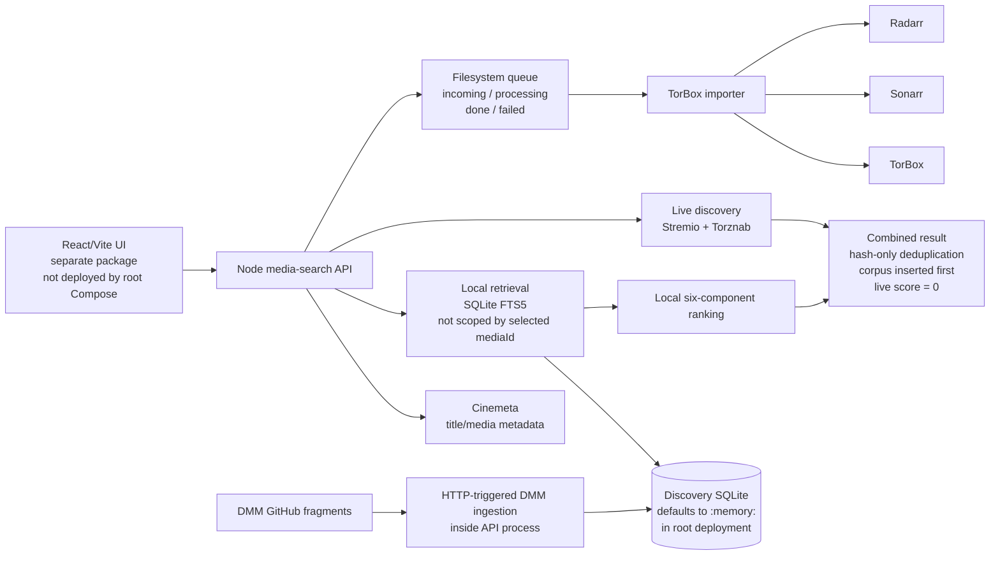
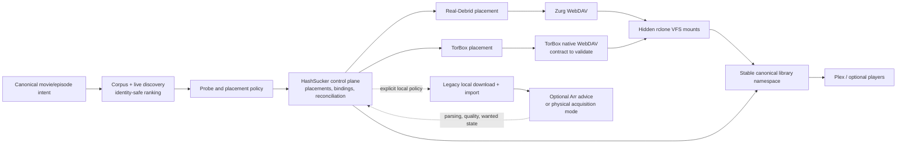

# Whole-system technical audit

## A. Executive architecture assessment

**Verified fact:** HashSucker has sound high-level domain boundaries and unusually strong local-import safeguards. Discovery, queue handoff, TorBox acquisition, and Sonarr/Radarr-controlled physical import are meaningfully separated.

**Verified fact:** The only implemented fulfillment path is local acquisition: TorBox placement is resolved to an expiring download URL, copied into local staging, and submitted to Sonarr/Radarr for import. The repository has no Real-Debrid adapter, Zurg or provider-WebDAV deployment, rclone mount inventory, canonical virtual-library projection, or provider-failover path.

**Verified fact:** The active discovery path is not yet identity-safe. Local retrieval is not constrained by the selected media ID, local and live candidates are not globally ranked, and `(infoHash, fileIndex)` identity collapses to hash-only in merging, UI identity, request handoff, and importer request persistence.

**Verified fact (at audit time):** Deployment did not match the pre-consolidation documentation. Root Compose defaults discovery state to memory, does not deploy the React UI, and the production image does not install the dependencies required by the current source tree. The canonical documents now describe those deployment defects explicitly; the implementation remains unchanged.

**Inference:** The architecture is viable, but the currently deployed discovery behavior should be treated as a prototype rather than a production recommendation engine. The importer is substantially closer to production-grade correctness than the search and enrichment path, but it implements the secondary physical-acquisition mode rather than the target primary product path.

**Recommendation:** Make the primary product path:

```text
large hash corpus
  → release and media intelligence
  → provider-specific cache likelihood
  → minimal authoritative cache probes
  → provider placement
  → provider-authoritative file mapping
  → stable provider-independent virtual media identity
```

HashSucker should be the control plane for intent, exact release selection, cache and provider decisions, placement records, canonical library bindings, reconciliation, and telemetry. Zurg plus WebDAV/rclone should expose Real-Debrid bytes; TorBox native WebDAV plus rclone is the target TorBox transport, subject to validation against the current service contract. Mature transports should own byte delivery instead of a custom HashSucker relay.

**Recommendation:** Present one provider-agnostic canonical library above hidden provider mounts. Provider paths and rclone-union collision policies must not become media identity. A stable canonical path should bind to an exact candidate, provider placement, and provider-authoritative file; changing or failing over the backing provider should update an auditable binding without changing the logical item or user-facing path.

**Recommendation:** Retain local download plus Sonarr/Radarr import as a secondary acquisition policy, not as the default fulfillment architecture. Arr participation in virtual mode should be optional and advisory unless a tested integration can adopt or index provider-mounted files without copying their bytes locally. Plex or another catalog may consume the canonical projection directly.

**Recommendation:** Do not rewrite the system or replace SQLite now. Fix deployment, security, identity propagation, exact-media retrieval, and unified ranking, then deliver a minimal mount-backed vertical slice before advanced release-family or learned-model work. Benchmark the resulting SQLite workload before considering another database.

**Inference:** The hash-intelligence hypothesis is technically sound: when provider checks are bounded and the plausible hash pool is large, source history, release evidence, family evidence, and prior provider outcomes can improve the probability of finding a desirable cached release per API call. This is a decision-layer problem over costly observations, not merely another release-quality score.

**Inference:** A useful virtual-library MVP does not depend on a trained cache model. Deterministic release desirability, fresh cache checks, exact placement, and stable projection are sufficient to validate the product path. The learned hypothesis remains conditional: its ceiling depends on provider check cost/rate limits, candidate-pool diversity, label quality, source correlation, and provider stability.

**Recommendation:** Treat persistent hash intelligence as a logical capability inside `media-search`. Do not make it a new service, a graph database, or a single global “reputation score.” Provider-specific cache priors must remain visibly separate from desirability, confirmed provider state, placement state, mount visibility, and library health.

**Recommendation:** Preserve these safeguards throughout all changes, with authority made explicit by mode:

- Explicit movie or episode intent.
- Exact `(infoHash, fileIndex)` candidate evidence at every control-plane boundary.
- Provider-authoritative physical-file mapping; browser or corpus file indexes are evidence, not authority.
- HashSucker authority over canonical virtual-library identity and binding history.
- Sonarr/Radarr authority over final library identity only in the secondary physical-import mode.
- Filesystem queue authority only for physical-acquisition commands; virtual reconciliation need not masquerade as an importer job.
- Provider resource ID and hash reconciliation.
- Download-size and post-import validation in local mode; mount, binding, scan, and playback validation in virtual mode.
- Conservative cleanup limited to resources and projections provably owned by the request.
- Unknown provider state on transient provider failures.

**Verified fact:** Validation completed without repository changes:

- Backend: **387/387 tests passed**.
- Frontend: **26/26 tests passed**.
- Repository status was restored to clean after deleting a test-generated untracked report.

**Inference:** Passing tests demonstrate baseline stability, not architectural correctness. Several problematic behaviors—such as hash-only deduplication and unscoped corpus retrieval—are currently expected or not covered by tests.

---

## B. Code-verified current-system architecture

**Verified fact:** The active runtime is approximately:



### What is structurally good

**Verified fact:** Discovery storage distinguishes candidates, parsed attributes, media associations, and provider observations.

**Verified fact:** The intended candidate key is `(info_hash, file_index_key)`, with a null file index represented internally by `-1`.

**Verified fact:** FTS maintenance is trigger-driven, reducing the chance that ordinary attribute updates leave the search index unsynchronized.

**Verified fact:** Live discovery tolerates partial source failures.

**Verified fact:** TorBox cache checking batches hashes, distinguishes global authentication failure from transient batch failure, and preserves unknown state for failed checks.

**Verified fact:** Queue publication and claiming use atomic filesystem operations: producer write-and-rename and importer `mv -n`.

**Verified fact:** The importer performs explicit intent checks, provider reconciliation, Arr identity validation, size verification, and terminal settlement.

### Where the active architecture diverges from the intended one

**Verified fact:** Local retrieval receives release text, season, and episode, but not the selected media ID.

**Verified fact:** An empty local release query becomes a wildcard. A movie selection can consequently return arbitrary recent corpus rows; a TV request can return unrelated shows sharing the requested season and episode numbers.

**Verified fact:** Local TV filtering requires an exact episode attribute, excluding season packs and many range releases even when they contain the requested episode.

**Verified fact:** The current SQL limit is applied before the full composite score is calculated.

**Verified fact:** Local candidates are ranked with six components, while normalized live candidates are assigned `score: 0` and empty components.

**Verified fact:** No final global `rankHits()` operation runs over the merged local and live pool.

**Verified fact:** Combined-result deduplication uses lowercase info hash only. Corpus entries are inserted first and win collisions even when the live entry contains better file or source evidence.

**Verified fact:** The request handoff and importer `requests` table preserve `infoHash` but omit `fileIndex`.

**Inference:** Candidate identity is currently strongest in the discovery database and progressively weaker at every outward boundary.

**Verified fact:** The current runtime has no virtual-library lifecycle. It cannot distinguish provider cache observation, placement, provider file, WebDAV exposure, mounted path, canonical binding, catalog scan, or playable outcome because none of those are modeled end to end.

**Target architecture:**



**Recommendation:** Keep control and data planes separate. HashSucker must know why a placement and binding exist and whether they are healthy, while Zurg, TorBox WebDAV, and rclone provide remote-file exposure and playback bytes. Do not route routine media bytes through `media-search`.

---

## C. Risk assessment and documentation drift

### Ranked risks

| Rank | Classification | Risk | Consequence | Required response |
|---:|---|---|---|---|
| 1 | **Verified fact** | Local corpus retrieval is not selected-media scoped | Cross-title and cross-series recommendations can appear valid because filename attributes happen to match | **Recommendation:** Require an exact selected-media association before a local candidate becomes eligible |
| 2 | **Verified fact** | Local and live results are not globally ranked | Source origin determines ordering more than candidate quality | **Recommendation:** Normalize both pools and perform one final rank |
| 3 | **Verified fact** | Hash-only deduplication collapses file-aware identity | Different files in a torrent can overwrite or suppress one another | **Recommendation:** Use exact `(hash,fileIndex)` identity at every boundary |
| 4 | **Verified fact** | Deployment is incomplete and discovery defaults to memory | Corpus and observations disappear on restart; clean images may fail; UI is absent | **Recommendation:** Fix image dependencies, DB persistence, and explicit UI deployment first |
| 5 | **Verified fact** | Credential-like provider configuration is committed | Potential provider-account compromise | **Recommendation:** If genuine, rotate immediately and remove it from repository history, images, logs, and backups |
| 6 | **Verified fact** | Ingestion, attribute mutation, and request endpoints have no application authentication | Remote mutation or resource-exhaustion risk if exposed beyond a trusted network | **Open question:** What network boundary, proxy authentication, and access control exist in production? |
| 7 | **Verified fact** | A nonterminal request can remain first in `processing` and be selected every worker loop | One blocked request can prevent all later work | **Recommendation:** Add retry eligibility/backoff and fair processing selection |
| 8 | **Verified fact** | The reachable DMM HTTP runner expects a script-call wrapper, while current real fragments use an iframe/hash wrapper; it also lacks transactions, checkpoints, locks, retries, and resumability | The API path can ingest zero records from valid current fragments, while successful alternate code remains unwired; full runs still risk poor throughput and unsafe restart/concurrency behavior | **Recommendation:** First route runtime ingestion through the verified extractor/decoder/parser, then add an incremental run lifecycle before increasing corpus size |
| 9 | **Verified fact** | Provider-observation age is ignored | Old cache states can influence ranking indefinitely | **Recommendation:** Make freshness and error state explicit |
| 10 | **Verified fact** | Runtime API fields, code-adjacent JSDoc/types, and UI types conflict; the consolidated Markdown contract now records the active runtime shape but is not executable | Runtime fields silently render missing or incorrect data | **Recommendation:** Add executable schemas/tests and generated or shared types |
| 11 | **Target risk** | A provider placement can exist while WebDAV, mount, canonical binding, catalog scan, or playback is stale or absent | “Cached” or “added” can be reported as success although the library item is unusable | **Recommendation:** Model and reconcile every lifecycle boundary separately with typed health and timestamps |
| 12 | **Target risk** | Provider paths or an rclone union become the canonical namespace | Provider migration, duplicate names, path reorganization, and first-found policy can change item identity or expose the wrong backing | **Recommendation:** Keep mounts hidden and project stable HashSucker-owned paths with explicit exact bindings |
| 13 | **Target risk** | Standard Arr import is pointed at remote mounts | Arr may copy remote content locally when atomic move or hardlink is unavailable, defeating the storage-light design | **Recommendation:** Keep Arr optional/advisory in virtual mode until no-copy behavior is proven; retain its authority in physical mode |
| 14 | **Target risk** | Provider eventual consistency, stale directory caches, expired links, or mount loss are treated as permanent absence | Healthy placements can disappear temporarily, or canonical paths can become dangling | **Recommendation:** Use bounded retries, mount and provider inventories, freshness-aware reconciliation, and fail-closed rebinding |
| 15 | **Target risk** | WebDAV or rclone credentials and writable mounts are broadly exposed | Provider-account compromise or destructive mutation of provider state | **Recommendation:** Isolate credentials per transport, prefer read-only media mounts, restrict control APIs, and make cleanup ownership-aware |

### Security disposition

**Verified fact:** `addons.local.json` contains credential-like encoded or URL-embedded values.

**Recommendation:** Do not merely delete the current file. If the values are genuine:

1. Rotate the provider credentials first.
2. Replace committed values with environment or secret-file references.
3. Purge sensitive values from Git history and derived images.
4. Review logs and backups for copied URLs.
5. Coordinate history rewriting because it invalidates existing clones and commit references.

**Verified fact:** Public request DTOs do not currently expose these credentials.

**Inference:** That reduces response leakage but does not mitigate repository, image, backup, or operator-access exposure.

### Documentation disposition

| Document | Classification | Disposition |
|---|---|---|
| `docs/archive/CODEX-2026-08-21.md` | **Verified fact** | Historical source for preserved safety and authority rules. Its UI/current-state descriptions are superseded by the canonical handoff. |
| `docs/archive/XHIGH-HANDOFF-2026-08-21.md` | **Verified fact** | Historical conceptual architecture; inaccurate about unified ranking, production UI serving, and persistence. |
| `docs/archive/architecture-pre-consolidation-2026-08-21.md` | **Verified fact** | Superseded architecture that overstated current integration and deployment. |
| `docs/archive/data-model-pre-consolidation-2026-08-21.md` | **Verified fact** | Superseded model narrative whose merge and association semantics did not fully enforce its stated invariants. |
| `docs/archive/pipeline-pre-consolidation-2026-08-21.md` | **Verified fact** | Superseded pipeline whose DMM “batch commit” and unified-ranking descriptions did not reflect active code. |
| `docs/archive/DMM-INGEST-BENCHMARK-2026-08-20.md` | **Verified fact** | Historical artifact from before commit `aafd82f`: its decoder-blocker conclusion is superseded, but its capacity figures were never replaced by a reproducible whole-corpus benchmark. |
| `docs/archive/known-gaps-pre-consolidation-2026-08-21.md` | **Inference** | Superseded gap list that understated identity safety, stale observations, deployment failures, DMM runtime-path divergence, and importer liveness. |
| `docs/archive/API_CONTRACT-conflicted-2026-08-21.md` | **Verified fact** | Superseded contract snapshot with merge markers, conflicting vocabularies, an unimplemented `/api/releases` route, and alternate-importer DMM statistics. |

**Recommendation:** Mark documentation claims as “target architecture” or “implemented behavior.” Do not mix both in the same unqualified flow description.

---

## D. DMM corpus scale and realistic SQLite limits

### What is actually known

**Verified fact:** `docs/archive/DMM-INGEST-BENCHMARK-2026-08-20.md` does not establish corpus capacity. Its decoder-blocker conclusion records the hand-written decoder used before commit `aafd82f`; the current shared `lz-string` decoder correctly decodes current real URI-component payloads.

**Verified fact:** Live validation on 2026-08-21 established the current data path, but not whole-corpus capacity:

- All 20 sampled current fragments used an iframe/hash wrapper rather than a `decompressFromEncodedURIComponent(...)` script call.
- The shared iframe extractor, decoder, and record parser decoded a representative real fragment and the secondary importer inserted all 49 valid records.
- The same importer processed the largest fragment in that listing: 175,740 records attempted, 130,858 inserted, 44,855 updated, 27 failed, and 175,393 attribute rows parsed in 15,972 ms.
- The current source listing contained 1,000 fragments totaling 147,770,692 listed bytes; the largest was 11,614,800 bytes.

**Verified fact:** Those results expose path divergence rather than a decoder defect:

- `POST /api/ingest/dmm` reaches `DMMIngestionRunner`, whose private extractor accepts only the script-call wrapper. It therefore reports `No payload found` for valid current iframe/hash fragments and never reaches the shared decoder.
- `src/lib/ingestion/dmm.js` uses `extractHashFragment()`, `decodeDmmPayload()`, and per-record `parseDmmRecord()` successfully on current real fragments, but it has no current server, CLI, package-script, or container caller outside tests.
- `dmm-benchmark.js` is directly runnable and has another permissive extractor/parser path, but is not an npm script or deployed entrypoint; its generated report predates the decoder replacement.

**Verified fact:** Repository documents still contain materially conflicting estimates:

- Approximately 200,000–500,000 records and a 100–200 MB database.
- Elsewhere, 50–100 million records and 10–20 GB.
- Approximately 750 MB compressed input accompanied by a smaller “uncompressed” estimate, versus the current 147,770,692-byte source listing.

**Inference:** None of those estimates, nor one successful large-fragment run, should drive a database migration. A reproducible whole-corpus run against a pinned source revision is still absent.

**Verified fact:** The two ingestion orchestrators also have different memory and write behavior:

- Both fetch a complete HTML fragment and materialize the complete decoded JSON string.
- The API-reachable runner scans that string into in-memory batches, performs repeated upserts without an explicit database transaction, runs attribute parsing after fragment processing, and executes inside an HTTP request in the synchronous Node API process.
- The currently unwired importer parses the complete payload into an array, then performs per-record candidate and attribute writes without an explicit encompassing transaction.

**Verified fact:** SQLite uses WAL, but there is no configured busy timeout, explicit checkpoint lifecycle, schema version, migration runner, run lock, or transaction API.

**Inference:** After the runtime extractor mismatch, the principal scale risks are per-row transactional overhead, decoded-payload memory, synchronous API blocking, and lifecycle design—not SQLite’s file-size limit.

### Plausible sizing envelope

These are intentionally broad engineering estimates, not measurements:

| Unique candidate scale | Classification | Plausible discovery footprint |
|---:|---|---:|
| 200,000–500,000 | **Inference** | Roughly 0.1–1 GB |
| 5–10 million | **Inference** | Roughly 3–20 GB |
| 50–100 million | **Inference** | Roughly 30–200+ GB |

**Inference:** FTS content duplication, indexes, release text length, media-association count, provider history, page utilization, and retained WAL can change these ranges by several multiples.

**Inference:** SQLite can physically store far more than these ranges. Practical viability will instead be determined by:

- Ingestion write amplification.
- FTS query latency.
- Association cardinality.
- Database maintenance time.
- Backup and recovery requirements.
- Single-writer contention.
- Peak API latency during ingestion.
- Node’s synchronous database calls.

**Recommendation:** SQLite remains a reasonable default for a single-host system through at least the first properly measured multi-million-candidate workload.

**Recommendation:** Treat tens of millions of FTS-indexed releases as a benchmark gate rather than a promise. At that scale, the design may still work, but operational behavior matters more than theoretical capacity.

### Required benchmark

**Recommendation:** Build a reproducible benchmark against an exact DMM source revision and record:

1. Fragment path and GitHub SHA.
2. Compressed, decoded, and parsed byte counts.
3. Raw record count, unique candidate count, and duplicate ratio.
4. Null versus non-null file-index distribution.
5. Attribute rows and FTS amplification.
6. Media associations per candidate.
7. Transactional ingestion rows/second.
8. Database, WAL, and peak RSS growth.
9. API query p50, p95, and p99 under concurrent ingestion.
10. Exact-media and FTS query plans.
11. Interrupted-run restart behavior.
12. Incremental changed-fragment synchronization.
13. Checkpoint and backup duration.
14. Projections at 1×, 3×, and 10× measured data.

### Target ingestion lifecycle

**Recommendation:** Add these concepts without creating a new service:

- `ingest_runs`: run identity, source revision, start/end state, counts, error.
- `source_fragments`: path, SHA/ETag, parsed version, status, attempt count.
- One writer lock.
- One transaction per fragment or bounded batch.
- Idempotent upserts.
- Retryable versus terminal fragment failures.
- Parser/enricher version markers.
- WAL checkpoint policy after bounded units.
- A CLI/one-shot worker using the same image and modules as `media-search`.

**Recommendation:** Do not wrap the entire corpus in one transaction. Use bounded transactions so restart, WAL growth, and failure isolation remain manageable.

**Recommendation:** Do not call in-memory arrays “streaming” unless peak memory remains bounded independently of fragment record count.

**Verified fact:** Current upstream evidence identifies the iframe/hash wrapper as the real-data-compatible representation. The remaining uncertainty is whether the script-call wrapper must be retained for historical or alternate fragments, not whether the current decoder can decode the sampled corpus.

---

## E. Candidate, file, media identity, and enrichment

### Canonical identity

**Recommendation:** Use this exact public identity consistently:

$$
\text{releaseKey} =
\operatorname{lower}(\text{infoHash}) + ":" +
\begin{cases}
\text{"torrent"} & \text{if fileIndex is null} \\
\text{fileIndex} & \text{otherwise}
\end{cases}
$$

**Recommendation:** Preserve the existing composite database key internally. The string key is for DTOs, logs, deduplication, React keys, request provenance, and diagnostics.

**Recommendation:** Interpret `fileIndex = null` as torrent-level or unknown-file evidence. It must not mean file zero.

**Recommendation:** Hash grouping may be offered as a presentation feature, but it must never be used as candidate deduplication.

### Canonical library, placement, and binding identity

**Recommendation:** Add a provider-independent library identity; do not overload `releaseKey` or a provider pathname. Keep these layers separate:

1. **Media intent identity:** canonical movie or episode ID and explicit scope.
2. **Candidate identity:** exact `releaseKey = (infoHash,fileIndexKey)` evidence.
3. **Placement identity:** provider plus provider resource/job ID for a torrent added to an account.
4. **Provider-file identity:** provider-authoritative file ID/path/index within that placement, mapped back to exact candidate evidence.
5. **Mount observation identity:** transport/mount instance plus the currently observed provider path and freshness.
6. **Canonical library identity:** stable media-item ID and stable user-facing path, independent of provider and release.
7. **Binding identity:** versioned assertion connecting one canonical path to one exact candidate, placement, provider file, and mount observation.

**Recommendation:** A canonical path is a logical projection, not proof that bytes exist. Binding records need status, version, reason, `validFrom`, optional `supersededAt`, last reconciliation time, and failure category. Rebinding for repair or provider failover must be atomic from the catalog’s perspective and preserve prior bindings for audit.

**Recommendation:** Define deterministic collision handling before materialization. Two providers exposing the same basename, one torrent exposing multiple plausible files, or two requested editions must never be resolved by directory order, rclone `epmfs`/`ff` policy, or whichever remote responds first.

**Recommendation:** A practical persistence shape is:

- `library_items`: canonical media identity, scope, edition/variant policy, desired state, canonical relative path, and catalog state.
- `provider_placements`: provider, resource ID, normalized hash, ownership/request provenance, state, and provider timestamps.
- `provider_files`: placement, provider-authoritative file identity/path/size, and candidate mapping confidence/reasons.
- `mount_instances` and `mount_observations`: transport, root, capabilities, health, observed provider path, size, and freshness.
- `library_bindings`: canonical item/path, exact `releaseKey`, placement, provider file, mount observation, version, lifecycle status, and validity interval.
- `library_events`: append-only requested, checked, placed, exposed, bound, scanned, playable, degraded, rebound, removed, and failed events with typed reasons.

**Recommendation:** Store logical paths relative to configured roots. Treat absolute mount roots as deployment configuration so remounting does not rewrite identity.

### Release-family identity and relationships

**Inference:** A persistent release-family layer is justified once exact candidate identity and versioned parsing are reliable. It supports evidence transfer and probe prioritization across materially equivalent releases; it must not become physical identity, media identity, or importer authority.

**Recommendation:** Model a release family as a derived, versioned assertion over hashes, not a replacement key. A practical relational shape is:

- Optional `torrents`: one row per normalized info hash, serving as the torrent-level parent of exact file candidates.
- `release_families`: opaque ID, canonicalized release signature/version, lifecycle status, confidence, and timestamps.
- `release_family_members`: family, info hash, membership status/confidence, reason codes, evidence version, `validFrom`, and optional `supersededAt`.
- `candidate_relationships`: exact `releaseKey` to exact `releaseKey` for genuinely file-level relationships, with relation type and the same audit fields.
- Optional family aggregates that are disposable and recomputable from observations.

**Recommendation:** Do not build a generic edge store unless relationship queries justify it. `release_family_members` is the clearer primary representation because the concept groups hashes; `candidate_relationships` is justified for file-aware evidence such as `same_torrent_different_file`, `same_content_file`, or explicit conflicts. Family-to-family relations can separately represent `repack_of`, `proper_of`, or `edition_variant`. Do not infer sameness from a shared media ID alone.

**Recommendation:** Identify families conservatively from normalized, release-level evidence such as media identity, season/episode coverage or movie year, edition/cut, resolution, source, video codec, HDR/DV profile, audio, release group, and stable release-name tokens. File size and file-list fingerprints can strengthen a match. Hard conflicts—different media, incompatible coverage, edition, source lineage, or materially different technical properties—must prevent automatic membership.

**Recommendation:** Use three outcomes: accepted, tentative, and rejected. Only accepted high-confidence relationships may contribute family-derived cache evidence. Tentative clusters may aid diagnostics or human review but must not deduplicate results, transfer confirmed provider state, select provider files, or broaden episode intent.

**Recommendation:** Family membership must be correctable and parser-versioned. Recompute derived membership after parser changes, preserve superseded assertions for audit, and split families rather than forcing transitive closure through weak pairwise links. Hash-level family membership does not erase exact file-candidate identity: every candidate reference still uses `(info_hash, file_index_key)`, while torrent/family tables are explicitly hash-scoped and never stand in for a candidate in APIs, deduplication, handoff, or import.

### Required identity propagation

**Recommendation:** Carry `infoHash`, `fileIndex`, and `releaseKey` through:

- DMM and live source adapters.
- Discovery storage.
- Local and live normalization.
- Deduplication.
- Ranking explanations.
- API DTOs.
- React row keys and selection state.
- Request handoff provenance.
- Importer request persistence.
- Audit and settlement logs.

**Verified fact:** Current handoff and importer request persistence omit `fileIndex`.

**Recommendation:** Preserve `fileIndex` in the request as discovery evidence only. The importer must still resolve provider-authoritative files and validate them against the explicit movie or episode intent.

**Recommendation:** Never allow a browser-provided file index to become physical-file-selection authority.

### Media identity and episode coverage

**Recommendation:** Separate:

- Canonical media identity: provider ID, type, title, year.
- Torrent/release identity: hash.
- Candidate identity: hash plus optional file index.
- Candidate-to-media association.
- Episode coverage.
- Provider availability observation.
- Provider placement and provider-authoritative file mapping.
- Mount observation and transport health.
- Canonical library identity and versioned binding.

**Recommendation:** Model episode coverage rather than only one episode integer:

- Single episode.
- Explicit episode set.
- Contiguous episode range.
- Season pack.
- Unknown coverage.

**Recommendation:** A season pack can be eligible for an explicit episode request when coverage includes that episode. Eligibility must not broaden the user’s request—the importer still selects only the intended episode.

### Association and evidence model

**Verified fact:** `candidate_media` omits `source` from its primary key, so multiple sources for the same candidate/media pair overwrite rather than coexist.

**Verified fact:** Association and release-attribute upserts do not independently enforce the documented “higher confidence wins” rule.

**Recommendation:** Store source evidence separately from the derived current association. A practical shape is:

- Immutable or append-only evidence rows keyed by candidate, media, source, and parser/enricher version.
- Derived association status: accepted, tentative, rejected, or stale.
- Confidence plus explicit reason codes.
- `observedAt`, `lastValidatedAt`, and version.
- Ability to supersede incorrect evidence without deleting history.

### Historical evidence and reputation data

**Inference:** The current model cleanly separates physical candidates, attributes, media associations, and the latest provider state, but it cannot support longitudinal hash intelligence or virtual fulfillment cleanly. `candidates.sources` is a merged JSON set rather than sighting history, and `provider_observations` overwrites the previous state. There is no durable family membership, probe-selection propensity, placement/binding outcome, import outcome, or model prediction record.

**Recommendation:** Extend the relational model rather than introducing a graph database:

- `source_sightings`: candidate key, normalized source/source instance, external item key when available, first/last seen, observation time, seeders/leechers, published time, and ingest run. Retain raw evidence only where bounded and useful.
- `provider_observation_events`: append-only provider, candidate/hash scope, state, check time, latency, error category, request/batch correlation, and check reason (`exploit`, `explore`, fulfillment, refresh). Keep a separate current-state projection for fast reads.
- `fulfillment_outcomes`: request/library item, exact candidate, family-at-decision, provider, placement and binding versions, stages reached, terminal typed outcome, bytes/files where applicable, catalog/Arr result, timestamps, and failure ownership.
- `cache_prior_predictions`: optional audit rows containing provider, subject, model/version, feature snapshot/version, probability, uncertainty, generated time, and decision context.
- Recomputable reputation aggregates by provider and feature cohort; never use aggregates as the sole source of truth.

**Recommendation:** A source sighting means that a source reported a candidate; it is not a provider cache observation. Successful placement, exposure, binding, cataloging, playback, download completion, and Arr acceptance are distinct downstream outcomes. Record each independently rather than treating any one as a proxy for all the others.

**Recommendation:** Bound high-volume history through rollups and retention: preserve state transitions, first/last sightings, sampled or aggregated swarm measurements, and all decision/outcome audit records; compact redundant unchanged polling events after a measured window.

### Enrichment correctness

**Verified fact:** Cinemeta matching currently accepts exact, prefix, and inclusion title relationships; does not reject year mismatches; does not verify expected media type; and constructs episode IDs without validating episode existence.

**Verified fact:** Enrichment can claim season/episode evidence even though the search response used for matching did not provide episode evidence.

**Verified fact:** Once any association exists, a candidate can cease to appear unenriched, making weak false positives sticky.

**Recommendation:** Enrichment should apply hard validation in this order:

1. Expected media type.
2. Normalized title compatibility.
3. Year compatibility with explicit policy for missing years.
4. Exact series identity.
5. Actual season/episode existence.
6. Candidate coverage compatibility.
7. Confidence threshold and ambiguity margin.

**Recommendation:** Weak alternatives should remain evidence, not become equivalent accepted identities.

**Recommendation:** Replace additive “number of tokens found” parser confidence with feature-specific evidence and calibrated outcomes. Numeric titles, title-leading years, alternate-language titles, collections, ranges, and packs require dedicated fixtures.

**Recommendation:** Use Sonarr/Radarr parsing outputs as behavioral test oracles where possible, rather than attempting to replicate their entire implementation immediately.

---

## F. Retrieval, unified ranking, and provider-observation lifecycle

### Current ranking

**Verified fact:** The active local formula is:

$$
S =
0.25R +
0.20Q +
0.20C_r +
0.15C_i +
0.10P +
0.10E
$$

where the components are relevance, quality, release confidence, identity confidence, provider availability, and episode match.

**Verified fact:** The formula is pure and explainable.

**Verified fact:** It is not currently a unified system score because live candidates bypass it.

**Verified fact:** Identity scoring uses the strongest candidate association, not necessarily the association matching the selected media ID.

**Verified fact:** Provider scoring ignores observation age, and mixed known/unknown states can dilute results through the denominator.

### Target retrieval pipeline

**Recommendation:** Implement one bounded, identity-safe pipeline:

1. Accept canonical selected media ID, media type, and explicit episode intent.
2. Retrieve local candidates through an exact association with that selected media.
3. Apply episode-coverage compatibility.
4. Use FTS as release-text retrieval or refinement—not as proof of media identity.
5. Retrieve live candidates in parallel.
6. Normalize both sources into one evidence shape.
7. Apply hard eligibility and rejection rules.
8. Deduplicate by exact `releaseKey`.
9. Compute provider-independent release desirability.
10. Compute a provider-specific cache prior from evidence available before this decision.
11. Order a bounded probe set using desirability, cache likelihood, uncertainty, probe cost, and an explicit exploration allocation.
12. Hydrate provider state in bounded waves and stop when policy-defined sufficient high-quality cached choices exist.
13. Keep confirmed availability authoritative; do not replace unknown state with the prediction.
14. Apply final ordered comparison and deterministic tie-breakers.
15. Paginate last.

**Recommendation:** If no exact local media association exists, omit that local candidate from selected-media results. Queue it for enrichment instead of returning an arbitrary filename match as though it were identified.

**Recommendation:** Join or batch-load candidate data needed for ranking. The current local query loses candidate size and source information and then performs N+1 hydration of associations and observations.

**Recommendation:** Retrieve a wider bounded pool than the requested page—for example, a configurable 5–10× page size with a hard ceiling—then rank and paginate. Benchmark the ceiling rather than embedding it as permanent policy.

**Recommendation:** Return `hasMore` or a clearly defined approximate total unless a complete eligible-result count is actually calculated. The current bounded merged count should not be described as a global total.

### Hard eligibility versus preference

**Recommendation:** Follow the Sonarr/Radarr pattern:

- Hard rejections first: wrong media, incompatible episode coverage, invalid hash, impossible size, disallowed source, or insufficient identity evidence.
- Preference scoring second: quality, custom formats, source reliability, recency, seeders, and cached status.
- Deterministic ordered comparison last.

**Inference:** This will be easier to debug than continuously adding weighted penalties to a single formula.

**Recommendation:** Keep score components and rejection reasons in API diagnostics. Do not expose secrets or provider URLs.

### Separate desirability, cache, placement, and library state

**Recommendation:** Expose these separate layers in diagnostics and decision records:

1. **Direct observations:** source sightings, parsed attributes, swarm samples, exact provider checks, and typed fulfillment events.
2. **Derived family evidence:** accepted membership and aggregates inherited from sibling hashes, with family/evidence version and confidence.
3. **Predicted cache probability:** $P(\text{cached by provider}\mid\text{evidence at decision time})$, with provider, model version, feature contributions, uncertainty, and timestamp.
4. **Confirmed provider availability:** fresh `cached`, `uncached`, `unknown`, or `error` state from that provider.
5. **Placement state:** absent, requested, processing, ready, failed, or removed for a provider resource.
6. **Exposure state:** whether the authoritative provider file is visible through the expected WebDAV and mount instance.
7. **Binding state:** whether a healthy exact provider-file target is projected at the intended canonical path.
8. **Catalog state:** whether the canonical item has been scanned and is visible to the selected catalog.
9. **Playback state:** when measured, whether the bound file can be opened and played/searched through the mature transport.

**Recommendation:** Release desirability answers “which release is preferable if available?” Cache prior answers “which unknown hash is worth checking first?” Confirmed provider state answers “what did the provider report?” Placement answers “does this account own a ready resource?” Exposure answers “can the transport currently see the selected file?” Binding, catalog, and playback answer distinct questions about the stable item’s usability. Never combine these into one persisted opaque success flag. A probe-policy utility may combine desirability, probability, exploration, and cost transiently and explainably, for example:

$$
U(c,p) = D(c)\,\widehat{P}_p(\mathrm{cached}\mid x_c)
          + \lambda I(c,p) - \mu C(c,p)
$$

where $D$ is desirability, $I$ is an uncertainty/exploration term, and $C$ is provider cost. This utility orders checks only; it is not availability state or the final release ranking.

### Cache-prior features and model

**Inference:** Plausibly predictive pre-check features include:

- Release group, resolution, source type, codec, HDR/audio profile, pack/single-release type, and size bucket.
- Release age, first/last sighting, sighting frequency, and swarm-health trend—not only the latest seeder count.
- Count of independent source families, repeated sightings, and cross-source agreement. Mirrored endpoints or adapters sharing an upstream must not be counted as independent evidence.
- Media popularity and request demand, with care not to make niche media permanently invisible.
- Provider-specific historical hit rates for the exact hash, accepted release family, group/type cohorts, and age buckets.
- Prior successful placement/exposure or physical-import outcomes as weaker operational evidence, provided they predate the prediction and are attributed to the same provider.
- Sibling-hash evidence from accepted high-confidence families, discounted by relationship confidence and age.

**Recommendation:** Exclude post-decision or leakage-prone fields from a prediction: the current check result, provider resource IDs created by the check, successful placement/exposure caused by that check, and aggregate values computed using outcomes after the prediction timestamp. File-index siblings sharing one info hash must not be counted as independent hash evidence.

**Recommendation:** Align labels and model rows with provider observation scope. If a provider reports cache state for a torrent hash, one check yields one hash-level label; do not duplicate it into independent positive samples for every `(info_hash, file_index_key)` candidate. File-aware state may be modeled separately only when the provider actually reports it.

**Recommendation:** Start with an explainable, regularized provider-specific logistic model or a hierarchical Beta-Binomial/log-odds score over a small feature set. Use smoothed cohort rates, monotonic age/recency buckets where appropriate, calibrated probabilities, minimum-support thresholds, and explicit feature contributions. This is sufficient until a time-split evaluation demonstrates that a more complex model materially improves cached desirable releases found per provider call.

**Recommendation:** Evaluate calibration (Brier score and reliability curves) and operational utility: calls to first desirable cache hit, desirable cache hits per 100 checks, early-stop success, false-confidence rate, p95 latency, and performance by popularity/age/source cohorts. Accuracy or AUC alone is insufficient.

### Provider-check budget and adaptive probing

**Recommendation:** Do not check every corpus candidate. Replace a fixed top-N-only policy with bounded waves:

- Rank eligible exact candidates for desirability without live provider checks.
- Estimate a separate cache prior for the selected provider.
- Reserve most of each batch for high expected utility and a configurable minority for exploration, uncertainty, new groups, weak-history sources, and lower-ranked strata.
- Batch according to provider limits; current TorBox code uses groups of ten.
- Re-rank the remaining unknown candidates after each wave.
- Stop only when enough cached candidates satisfy explicit desirability/diversity thresholds or the latency/call budget is exhausted.
- Perform an authoritative check again during acquisition when freshness policy requires it.

**Recommendation:** Make batch size, maximum checks, exploration rate, and early-stop threshold configurable per provider. Log every eligible candidate’s selection probability or deterministic selection reason so model evaluation can correct for selection bias.

**Recommendation:** Bootstrap with broad, conservative priors: exact fresh provider observations first; then documented provider behavior and local aggregate base rates; then smoothed release-group/type/source/age cohorts; then family evidence. Unknown or low-support cohorts should shrink strongly toward the provider base rate. A short shadow period should check a wider stratified sample before priors affect early stopping.

**Recommendation:** Do not assume cache behavior transfers unchanged between providers. Estimate separately:

$$
P(\mathrm{TorBox\ cached}\mid x)
\ne
P(\mathrm{RealDebrid\ cached}\mid x)
$$

Providers differ in user population, retention, ingestion mechanics, regional catalog, API semantics, and observation scope. Share the feature vocabulary and optionally use a global prior only as shrinkage for cold-start providers; retain provider-specific intercepts, feature effects, TTLs, calibration, budgets, and health state.

### Temporal decay and anti-feedback controls

**Recommendation:** Apply time semantics by evidence class rather than one global half-life:

- Confirmed provider state follows the short positive/negative TTL policy below and then becomes stale/unknown; it is never silently converted into a prior.
- Swarm health and source activity decay quickly—typically hours to days—using sampled trends.
- Freshness and release age are explicit model features; they should not be represented only by decaying a score.
- Source/group/family success aggregates decay more slowly—initially evaluate half-lives in the 30–90 day range—and shrink toward the provider base rate as effective sample size falls.
- Stable release attributes and exact identity do not decay, while parser/family assertions are invalidated by version or correction.

A practical exponentially decayed event weight is:

$$
w_i(t) = q_i r_i \exp\left(-\ln 2\,\frac{t-t_i}{h_k}\right)
$$

where $q_i$ is evidence quality, $r_i$ is family/relation confidence, and $h_k$ is the half-life for evidence class $k$. Cap correlated repeated sightings so high polling frequency cannot manufacture reputation.

**Recommendation:** Prevent self-reinforcing bias through all of the following:

- A persistent exploration quota and stratified random checks.
- Propensity/selection-reason logging for every provider probe.
- Training labels from authoritative checks, including uncached outcomes and unknown/error separation—not only successful imports.
- Time-based train/evaluation splits and counterfactual replay against the same candidate pools.
- Minimum cohort support, Bayesian shrinkage, feature caps, and exclusion of current-decision outcomes.
- Coverage dashboards for candidates never checked and performance slices for unpopular, old, new-source, and low-history releases.
- Periodic wider audit batches and champion/challenger shadow models.

### Observation lifecycle

**Recommendation:** Store an explicit observation state:

- `cached`
- `uncached`
- `unknown`
- `error`

with:

- Provider.
- Observation scope: torrent or exact file.
- `checkedAt`.
- `expiresAt`.
- Provider evidence.
- Error category.
- Latency.
- Optional provider resource identifier.

**Recommendation:** Initial TTL policy can start conservatively:

- Positive result: fresh for roughly 10 minutes, then decay or become unknown.
- Negative result: fresh for roughly 5 minutes, because it can become positive after acquisition.
- Transient error: remain unknown and retry with exponential backoff from approximately 30 seconds to 5 minutes.
- Authentication error: open the circuit and surface an operator-visible provider fault.

**Inference:** Exact TTLs are operational policy and require measurement; their separation matters more than the initial values.

**Recommendation:** Never convert timeout, rate limiting, network failure, or provider 5xx into `uncached`.

**Recommendation:** Reuse the robust failure semantics in `providers/torbox.js`, but connect them to the active unified search path rather than restoring the broken legacy orchestration wholesale.

### Provider placement and fulfillment policy

**Recommendation:** Define one provider capability contract over Real-Debrid and TorBox without pretending their APIs or mounts are identical. The control-plane contract should cover:

- Bulk cache check with explicit scope, freshness, and unknown/error semantics.
- Placement lookup/reuse and placement creation by normalized hash.
- Placement state and provider-owned resource identity.
- Provider-authoritative file inventory and exact candidate mapping.
- Transport capability and mount/path observation.
- Ownership-aware removal, disabled by default for resources not created by HashSucker.
- Rate-limit, retry, authentication-fault, and eventual-consistency signals.

**Recommendation:** Keep cache checks, placement, and file exposure as separate operations. A cached hash is not necessarily present in the account; an account placement is not necessarily finished; a finished placement is not necessarily visible through WebDAV; a visible provider path is not necessarily bound to the requested media.

**Recommendation:** Placement policy may choose one provider or intentional redundancy based on fresh confirmed cache state, deterministic release desirability, account/resource limits, provider health, placement latency, transport health, existing ownership, and operator policy. A learned cache prior may reduce checks later but is not an MVP prerequisite and must never override authoritative failures.

**Recommendation:** Failover should prefer rebinding to an already validated redundant placement. Creating duplicate placements has provider-side retention and account-cost consequences and must be explicit policy, not an accidental effect of retries. Persist idempotency/provenance so reconciliation reuses owned resources rather than adding the same torrent repeatedly.

---

## G. Provider-backed virtual library and mature byte transport

**Recommendation:** Use mature provider and filesystem transports for the data plane:

- Real-Debrid placement → Zurg WebDAV → rclone VFS mount.
- TorBox placement → native TorBox WebDAV → rclone VFS mount, after validating current authentication, directory, file-selection, refresh, and availability behavior.
- Hidden provider mounts → HashSucker-controlled canonical projection → Plex or another catalog/player.

Zurg is specifically designed to expose Real-Debrid through WebDAV for rclone/Plex use and includes configurable organization and repair behavior. rclone already implements WebDAV access, FUSE/VFS mounting, directory/file caching, Range/chunk reads, read-only operation, and buffering policies. HashSucker should integrate and observe those layers, not recreate them.

### Canonical projection

**Recommendation:** The provider-agnostic library belongs above provider mounts. It may be implemented initially with atomic symlink projection if the catalog, container topology, filesystem, and failure semantics validate correctly; a purpose-built virtual filesystem is justified only if symlink projection cannot provide atomic rebinding, stable paths, correct metadata, and acceptable scanner behavior.

**Recommendation:** Do not use rclone union as the semantic library. It can merge directory trees, but first-found, existing-path, and free-space policies cannot enforce canonical media identity, exact release binding, placement preference, edition handling, or provider failover. If union is used operationally below the projection, HashSucker must still own every canonical binding.

**Recommendation:** Canonical projection must be deterministic, read-only to consumers, and reconstructible from persisted state. Publishing or rebinding a path should use create-and-rename semantics where the projection mechanism permits them. Never leave a new canonical path visible before its exact provider file and mount target have been validated.

### Reconciliation and completion semantics

**Recommendation:** Reconcile desired library state against provider resources, provider file inventories, WebDAV/mount observations, projection targets, and catalog visibility. Reconciliation must tolerate eventual consistency and stale caches without converting temporary absence into deletion.

**Recommendation:** Define distinct success milestones:

```text
requested → checked → placed → provider-ready → exposed
          → exact-file-mapped → bound → cataloged → playable
```

The product may declare a request fulfilled at a policy-selected milestone, but the UI and telemetry must show the actual state. “Cached,” “placement ready,” and “playable” are never synonyms.

**Recommendation:** Monitor mount liveness, observation age, target existence, size agreement, binding drift, canonical-path collisions, catalog scan result, and optional playback/open probes. Repair should be bounded and ownership-aware: refresh/re-observe before re-place; rebind before duplicate placement; never delete unowned provider resources because a mount is stale.

### Arr and catalog participation

**Recommendation:** Plex can consume one projection root, or multiple deployment/media-type roots when operationally useful; all remain folders within one logical provider-agnostic canonical library. Prefer stable paths so provider changes do not cause metadata churn.

**Recommendation:** Sonarr/Radarr may contribute parsing, quality/custom-format preferences, media identity, monitoring/wanted state, and refresh/rescan signals. Do not make standard completed-download import part of the virtual path: move/hardlink/copy behavior can copy remote bytes when hardlinks or atomic moves are unavailable, and remote path mappings are only path translation rather than a canonical overlay.

**Recommendation:** The robust default is direct canonical projection plus catalog refresh. Any Arr-compatible download-client or no-copy integration should be feature-flagged and accepted only after tests prove that it preserves stable identity, does not copy bytes locally, does not let Arr rename provider storage, and recovers cleanly from rebinding.

### Custom resolver fallback

**Recommendation:** Do not put a HashSucker HTTP byte relay on the primary roadmap. Consider one only after measured Zurg/TorBox WebDAV/rclone failures show that direct mounted playback cannot meet required seeking, concurrency, refresh, or security behavior and cannot be corrected through transport configuration or upstream components.

**Recommendation:** If that fallback becomes necessary, require the former relay safeguards: opaque identifiers; no client-supplied upstream URLs; provider/scheme and redirect validation; token and signed-URL redaction; `GET`, `HEAD`, single-range `206`/`416`, cancellation, and backpressure conformance; bounded expiry refresh; and isolated concurrency/bandwidth limits. It should be a separately load-tested data-plane component, not ordinary request handling in `media-search`.

---

## H. Service boundaries and importer safety

### Minimal boundaries

**Recommendation:** Keep `media-search` as the primary control-plane codebase. Its logical modules should include:

- Metadata providers, local retrieval, live discovery, and normalization.
- Release-family derivation and reputation aggregates.
- Desirability ranking and provider-specific probe policy.
- Provider adapters, cache observations, and placement policy.
- Provider-file and mount inventory.
- Canonical library intent, bindings, reconciliation, and typed telemetry.
- Publication of explicit physical-acquisition requests when that secondary policy is selected.

**Recommendation:** Introduce the canonical materializer/reconciler as a logical boundary, not automatically a new product or bespoke byte service. It may run in the `media-search` process for an initial single-host vertical slice. Split it into a worker only when mount namespace access, independent reconciliation scheduling, fault isolation, or privilege separation requires that deployment boundary.

**Recommendation:** Treat Zurg, rclone, Plex, and—once its current contract is validated—TorBox native WebDAV as integrated external data-plane/catalog components with explicit version, configuration, health, and credential contracts. Do not hide them behind an invented claim that HashSucker has only two deployables.

**Recommendation:** Run DMM synchronization as a one-shot command from the same image and codebase. It can become a separately scheduled process without becoming another independently designed service.

**Recommendation:** Keep the filesystem queue authoritative for legacy physical-acquisition ownership. Redis, Kafka, or a database queue would add operational surface without addressing the current correctness defects. Virtual desired state, bindings, and reconciliation belong in transactional control-plane persistence and need not be serialized through shell importer files.

**Recommendation:** Retain `torbox-importer` unchanged in authority as the secondary local-download executor during a strangler migration. Do not generalize its shell workflow into the provider-neutral virtual materializer: its staging, `aria2c`, and Arr `ManualImport` lifecycle encode the wrong primary fulfillment model.

### Importer safeguards to retain

**Verified fact:** The importer already has the strongest safety properties in the repository:

- Explicit scope validation.
- Atomic claim behavior.
- Persistent SQLite state with WAL and foreign keys.
- Reconciliation of retained completed provider jobs.
- Sonarr/Radarr validation.
- Download-size checks.
- Post-import state checks.
- Conservative behavior on ambiguity.
- Provider material retention on many failure paths.

**Recommendation:** Do not weaken those checks to make discovery integration easier.

**Recommendation:** Discovery may propose a candidate file index, title, and size as evidence. The importer must map that evidence to provider files and validate the final choice independently.

### Head-of-line blocking

**Verified fact:** The worker repeatedly chooses the first file in `processing`.

**Verified fact:** `process-request.sh` can return a blocked/manual-selection status while leaving that request in `processing`.

**Inference:** One repeatedly blocked request can monopolize the worker indefinitely.

**Recommendation:** Preserve crash-resumable processing while adding:

- Attempt count.
- `nextAttemptAt`.
- Last error category.
- Exponential backoff.
- Fair selection among eligible processing requests.
- A terminal dead-letter or blocked state after policy-defined exhaustion.
- Operator-visible requeue.

**Recommendation:** These fields may live in importer SQLite while the JSON spool remains authoritative for ownership and terminal movement.

### Cleanup policy

**Verified fact:** A legacy movie path can process unrequested provider jobs, and its no-request cleanup policy can return `delete-legacy`.

**Open question:** Is deletion of unrequested legacy provider material an intentional current policy, or residual behavior predating the request-owned cleanup contract?

**Recommendation:** Default to retain unless ownership is proven by request ID, provider ID, and expected hash. Disable legacy deletion until that policy is explicitly reviewed.

### Outcome telemetry across fulfillment boundaries

**Recommendation:** Feed typed, append-only outcome events into the intelligence store without changing legacy queue ownership or weakening importer validation. Use request/library item ID, exact `releaseKey`, expected hash, provider, placement ID, binding version, and timestamps for correlation; do not infer candidate identity from title or path text.

Capture distinct milestones and terminal reasons for both modes:

- Authoritative provider check result and observation scope.
- Placement reused/created, provider state transitions, latency, rate limiting, and terminal failure.
- Provider file inventory and exact mapping accepted/rejected, including ambiguity.
- WebDAV observed/missing, mount healthy/stale/unavailable, and expected target/size agreement.
- Canonical binding published/rebound/degraded/removed with old and new binding versions.
- Catalog refresh requested and item visible/missing; optional open/playback probe result.
- For physical mode: download started/completed, bytes, duration, Arr acceptance/rejection, import/post-import verification, and cleanup.
- Incorrect-media, wrong-episode, size mismatch, collision, manual-selection, cancellation, ownership refusal, and infrastructure/transient failures.

**Recommendation:** Define label semantics before modeling. A provider `cached` response is ground truth for cache-state prediction at its observation time. Placement success is operational evidence, not a substitute for an unavailable cache check. Mount or catalog failure does not mean uncached. Arr rejection may describe identity/quality policy rather than provider state. Incorrect bindings/imports are negative evidence for parsing, mapping, family, or desirability decisions, not proof that the hash was uncached.

**Recommendation:** Preserve family ID, provider policy, selected provider, model/feature version, and binding version used at decision time so later corrections do not rewrite historical evaluation. Store no provider URLs, WebDAV credentials, tokens, mount secrets, or sensitive response bodies in telemetry.

### API exposure

**Recommendation:** Put ingestion, attribute-worker, and acquisition mutation routes behind authenticated operator or user boundaries. Network isolation alone should be documented if it remains the chosen control.

---

## I. Staged and reversible improvement plan

### Stage 0 — Security and deployability

**Recommendation:**

- Rotate and remove committed credentials.
- Add authentication or documented network enforcement for mutation routes.
- Install production dependencies in the image.
- Choose one UI deployment model: build into `media-search` or deploy a separate UI service.
- Persist `DISCOVERY_DB` on a mounted volume.
- Add clean-image startup and restart-persistence tests.

**Exit criterion:** A clean deployment starts, serves the intended UI/API topology, and retains discovery state across restart.

**Rollback:** Configuration and image rollback; credential rotation itself should not be reversed.

### Stage 1 — Executable API contract

**Recommendation:**

- Convert the consolidated code-verified Markdown contract into executable schemas or contract tests.
- Synchronize code-adjacent JSDoc and React types with the selected active normalized fields.
- Correct known runtime contract defects, including validation/error and confidence mapping behavior.
- Add `releaseKey` and propagate `fileIndex` through every boundary.
- Validate request and response DTOs at runtime.
- Keep nonexistent routes out of the current contract.

**Exit criterion:** Contract tests cover API and UI field compatibility.

**Rollback:** Additive DTO fields permit old clients to remain functional during migration.

### Stage 2 — Exact identity and identity-safe retrieval

**Recommendation:**

- Propagate `releaseKey`.
- Deduplicate by exact candidate identity.
- Require selected-media associations for local results.
- Add explicit episode-coverage matching.
- Preserve file index in request provenance.
- Keep physical-importer authority unchanged.

**Exit criterion:** Cross-title, same-episode, season-pack, range, and multi-file-torrent fixtures pass.

**Rollback:** Keep the old search path behind a feature flag during comparison.

### Stage 3 — Canonical normalization and global ranking

**Recommendation:**

- Define one local/live candidate DTO.
- Apply hard eligibility.
- Rank both sources with one implementation.
- Paginate after ranking.
- Add deterministic tie-breakers.
- Run old and new outputs in shadow mode.

**Exit criterion:** Offline evaluation and production shadow metrics show no identity regressions and explain ranking changes.

**Rollback:** Switch response selection back to the old path without discarding shadow data.

### Stage 4 — Provider capability contract and fresh observations

**Recommendation:**

- Define provider-neutral check, placement, resource-state, file-inventory, ownership, and transport-capability contracts.
- Add status, TTL, observation scope, and error-category semantics.
- Preserve append-only provider-check events plus a current-state projection.
- Hydrate only a bounded candidate set in configurable waves.
- Reuse TorBox batching and error behavior behind the contract; add Real-Debrid checks without leaking one provider’s semantics into the other.
- Add per-provider rate budgets and circuit breakers.
- Ignore stale confirmed state and distinguish it from historical prior evidence.
- Log the eligible candidate/provider pool, deterministic selection reason, latency, and stop reason even before a learned policy exists.

**Exit criterion:** The same exact candidate can be checked against either configured provider, with provider-specific scope, freshness, rate limiting, and unknown/error behavior visible and no cross-provider state leakage.

**Rollback:** Disable one or both live provider adapters while retaining provider-independent ranking and observation history.

### Stage 5 — Canonical library contract and shadow reconciliation

**Recommendation:**

- Define virtual, physical, and automatic fulfillment policies plus their authority and completion semantics.
- Add placement, provider-file, mount-instance, mount-observation, canonical item, versioned binding, and append-only library-event persistence.
- Establish deterministic canonical path and collision rules independent of provider paths.
- Inventory configured provider mounts read-only and reconcile them in shadow mode without publishing canonical paths or creating/deleting provider resources.
- Define direct Plex/catalog refresh as the default virtual integration and document Arr as optional/advisory in this mode.
- Validate whether atomic symlink projection is sufficient before considering a custom filesystem.

**Exit criterion:** Given fixtures for duplicate basenames, missing mounts, stale observations, multi-file torrents, and provider failover, the reconciler produces deterministic desired bindings and typed failures without mutating providers or the visible library.

**Rollback:** Disable reconciliation scheduling and discard only derived shadow projections; exact candidates, provider observations, and historical events remain.

### Stage 6 — Real-Debrid/Zurg vertical slice

**Recommendation:**

- Integrate Real-Debrid cache check, idempotent placement/reuse, authoritative file inventory, and exact candidate mapping.
- Deploy or configure Zurg WebDAV and a hidden read-only rclone VFS mount with explicit health and credential boundaries.
- Materialize one stable canonical movie path and one explicit episode path above the hidden mount.
- Trigger the selected catalog refresh and observe path visibility and an optional safe open/playability check.
- Exercise repair and rebinding without changing the canonical path or deleting unowned Real-Debrid resources.

**Exit criterion:** A selected exact candidate progresses through checked, placed, provider-ready, exposed, mapped, bound, and catalog-visible states; restart and a simulated stale/missing mount recover through idempotent reconciliation with no local media copy.

**Rollback:** Remove the canonical projection and disable the Real-Debrid adapter; Zurg/rclone state and provider resources are retained unless explicit ownership-safe cleanup is requested.

### Stage 7 — TorBox WebDAV parity and physical fallback hardening

**Recommendation:**

- Validate TorBox’s current native WebDAV contract, including authentication, placement/file visibility, directory stability, refresh latency, Range behavior through rclone, and provider-file mapping.
- Implement TorBox through the same placement, mount-observation, and binding contracts; do not route it through the shell importer for virtual mode.
- Demonstrate provider-policy selection and rebinding between validated Real-Debrid and TorBox placements while preserving canonical identity.
- Retain local download plus Arr import as an explicit secondary fulfillment policy.
- Add fair eligible-request selection, backoff, and blocked/dead-letter visibility to `torbox-importer`; preserve Arr, ownership, hash, size, and post-import validations.

**Exit criterion:** The same canonical item can use either provider without path or media-identity churn, and a blocked physical import cannot prevent an unrelated valid request from completing. If TorBox WebDAV fails validation, the virtual adapter remains disabled and physical TorBox mode remains available.

**Rollback:** Disable TorBox virtual placement/binding independently; preserve the legacy queue’s existing four-directory lifecycle and use Real-Debrid virtual or explicit physical fulfillment.

### Stage 8 — Resilient virtual-library cutover and complete telemetry

**Recommendation:**

- Make requested, checked, placed, provider-ready, exposed, mapped, bound, cataloged, playable, degraded, rebound, and removed distinct states and events.
- Add bounded eventual-consistency retries, mount liveness, stale-target detection, atomic rebinding, ownership-safe cleanup, and operator repair controls.
- Add intentional redundancy policy without making duplicate placement an automatic retry side effect.
- Feature-flag virtual fulfillment per provider/media scope and retain immediate physical-mode fallback.
- Evaluate an Arr-compatible no-copy path only behind a separate flag; direct projection plus catalog refresh remains the default.
- Record complete candidate/provider decision pools and typed outcomes for later probe-policy evaluation.

**Exit criterion:** Controlled failure tests cover provider lag, mount loss, stale directory cache, target disappearance, provider rebinding, process restart, catalog scan failure, and cleanup refusal. The UI never reports `cached` or `placed` as `playable`.

**Rollback:** Stop publishing new virtual bindings, preserve existing healthy projections or remove them by policy, and route new requests to explicit physical mode without changing candidate identity.

### Stage 9 — Transactional, resumable DMM ingestion

**Verified fact:** Decoder repair is not a prerequisite. The current shared decoder works on real current payloads; the API-reachable runner fails earlier because its extractor does not recognize the current iframe/hash wrapper.

**Recommendation:**

- Make the runtime path use the verified current wrapper extraction, shared decoder, and record parser; retain alternate-wrapper support only if pinned fixtures or source evidence require it.
- Introduce run and fragment state, source SHA/ETag, bounded transactions, and writer locking.
- Move execution out of the request lifecycle and add retry/interrupted-run recovery.
- Run a pinned, reproducible whole-corpus capacity benchmark before changing databases.

**Exit criterion:** The runtime ingestion path processes a pinned real iframe/hash fragment, and a killed run resumes without reprocessing successful unchanged fragments or corrupting current results.

**Rollback:** Retain the previous database and atomically switch database paths only after successful validation.

### Stage 10 — Correctable enrichment and parser experiments

**Recommendation:**

- Version parser/enricher evidence.
- Enforce media type and episode existence.
- Store competing evidence rather than overwriting it.
- Add rejection reasons.
- Compare a new parser against current behavior and Sonarr/Radarr fixtures.

**Exit criterion:** Precision improves on a hand-labeled evaluation set; “produced a value” is no longer counted as parsing success.

**Rollback:** Recompute derived associations from the previous evidence version.

### Stage 11 — Conservative release families

**Recommendation:**

- Introduce versioned `release_families` and hash-level `release_family_members`; add `candidate_relationships` only for genuinely file-level relations.
- Build conservative family matching from corrected parser evidence and explicit hard-conflict rules.
- Keep exact candidates in result sets, placements, bindings, and request provenance; families provide evidence only.
- Build disposable provider/cohort/family aggregates from event history with decay, correlation caps, and minimum support.

**Exit criterion:** A labeled family fixture set meets a high precision threshold; every membership, relationship, and aggregate is explainable and recomputable; no family operation changes candidate deduplication, episode intent, provider-file authority, or canonical bindings.

**Rollback:** Disable family-derived features and rebuild projections without deleting exact candidates or raw observations.

### Stage 12 — Explainable cache-prior probe policy

**Recommendation:**

- Establish provider-specific broad base-rate priors and run a stratified shadow-data period.
- Train a simple regularized logistic or hierarchical smoothed model using only evidence available at prediction time.
- Persist model version, feature snapshot/contributions, probability, uncertainty, and decision context where auditability requires it.
- Order checks by explainable probe utility in bounded waves, with a permanent exploration quota.
- Calibrate and evaluate on forward time splits against fixed-top-N, desirability-only, and random/stratified baselines.
- Enable early stopping only after desirable cache hits per API call improve without unacceptable cohort coverage or false-confidence regressions.

**Exit criterion:** Shadow and controlled rollout show calibrated provider-specific probabilities and fewer calls to a desirable cached result; predicted, stale, unknown, confirmed, placed, exposed, and playable states are unmistakable in storage, API diagnostics, and UI.

**Rollback:** Select probes using provider-independent desirability plus stratified sampling. Observation, placement, binding, and outcome events remain useful.

### Explicit non-goals

**Recommendation:** Do not:

- Replace SQLite before measurement.
- Split logical modules into fashionable microservices.
- Adopt a graph database merely because release relationships form a conceptual graph.
- Fuzzy-merge candidates or deduplicate results by release family.
- Treat family membership, cache prior, placement, mount visibility, catalog visibility, or import success as confirmed provider availability.
- Treat `cached`, `placed`, `exposed`, `bound`, `cataloged`, and `playable` as interchangeable states.
- Treat hash-only identity as sufficient for files.
- Use one provider’s prior, observation, or placement as another provider’s confirmed state or uncalibrated probability.
- Let provider paths, torrent names, rclone union policy, or catalog scan order define canonical media identity.
- Eliminate exploration after the learned probe policy appears effective.
- Broaden explicit episode intent based on release contents.
- Trust browser file selection.
- Treat provider errors or mount absence as negative cache observations.
- Make a custom HTTP byte proxy the default while mature WebDAV/VFS transports satisfy requirements.
- Require Sonarr/Radarr to import the virtual library or assume remote path mappings create a canonical overlay.
- Bypass Sonarr/Radarr identity authority in physical-import mode.
- Relax request, placement, projection, ownership, and hash checks during cleanup.
- Destabilize or generalize the legacy importer while building provider-neutral virtual fulfillment alongside it.

---

## J. Specific external projects/components worth studying or borrowing

| Project/component | Classification | Worth borrowing | Do not copy |
|---|---|---|---|
| Sonarr and Radarr | **Recommendation** | Release parsing fixtures, quality parsing, typed rejection reasons, custom-format scoring, monitoring/wanted state, and catalog refresh hooks | Their entire .NET architecture; forcing completed-download import into virtual mode; assuming remote path mappings provide a canonical overlay |
| Plex | **Recommendation** | Cataloging a stable canonical root and, where useful, multiple folders in one user-facing library | Exposing volatile provider organization as the durable library namespace |
| Zilean | **Recommendation** | Scheduled DMM lifecycle, minimum redownload interval, per-page checkpoints, bounded channels, batch parsing, and schema migrations | Its Postgres requirement or info-hash-only identity |
| Zilean error handling | **Verified fact** | Use as a cautionary test case | Do not mark a failed fragment parsed with zero entries; that can make failure sticky |
| Decypharr | **Recommendation** | Provider interfaces, WebDAV/VFS, link-refresh behavior, and Arr-compatible integration patterns to evaluate | A resolver service before byte delivery is required, or unverified no-copy Arr semantics |
| StremThru | **Recommendation** | Unified provider/store interface, server-side tokens, multi-hash checks, and proxy/tunnel boundaries | Exposing provider tokens or arbitrary upstream URLs |
| Riven | **Recommendation** | Provider placement abstractions, virtual-library organization, reconciliation, and optional VFS patterns | Its complete orchestration or identity model without preserving exact file-aware provenance |
| Zurg | **Recommendation** | Real-Debrid WebDAV+rclone operation, configurable organization, Plex integration, and on-demand dead-link repair concepts | Treating provider paths as canonical identity or the public repository as an inspectable implementation; it is primarily binaries, configuration, and documentation |
| rclone WebDAV/mount | **Recommendation** | Mature VFS caching, Range/chunk reads, read-only mounts, mount health, and operational tuning | Treating VFS cache presence as provider/cache truth |
| rclone union | **Recommendation** | Optional low-level aggregation after explicit evaluation | Using first-found/existing/free-space policies for canonical media identity, exact binding, placement, or failover decisions |
| TorBox native WebDAV | **Open question** | Validate as the TorBox data-plane path behind the same mount/binding contract | Making production claims from stale help links or assuming behavior matches Zurg/Real-Debrid |
| RTN | **Recommendation** | Evaluate directly for filename parsing, quality/custom-format evidence, and ranking vocabulary | Adopt unseen behavior without a local labeled evaluation; repository indexing was unavailable during this audit |
| Prowlarr | **Recommendation** | Torznab capability discovery and media-specific query construction | Continue assuming every endpoint returns JSON or supports generic `t=search` semantics |
| SQLite WAL plus a backup tool such as Litestream | **Recommendation** | Single-host backup and disaster-recovery evaluation after persistent storage is enabled | Treat backup tooling as a solution to ingestion transactions or query design |

**Recommendation:** Borrow behavior, interfaces, test cases, and lifecycle patterns before borrowing code. Verify license compatibility and preserve HashSucker’s stronger exact file-aware identity, provider-observation semantics, canonical binding history, and physical-import safeguards.

**Final inference:** The shortest path to the target product is not a rewrite or a byte proxy. It is a control-plane strangler: make deployment and exact discovery identity truthful, place one validated release on Real-Debrid, expose it through Zurg/rclone, bind it to a stable canonical path, and reconcile that path through catalog visibility. Add TorBox WebDAV behind the same contracts, while retaining the existing local importer as an explicit fallback.

**Hash-intelligence addendum:** The defensible product layer is the decision system over a large persistent corpus: deterministic release intelligence first, provider-specific confirmed observations and placement outcomes next, and learned cache priors only after unbiased labels exist. Its value must be proven by fewer provider calls to a desirable usable library item, without conflating prediction, cache, placement, exposure, binding, cataloging, or playback.