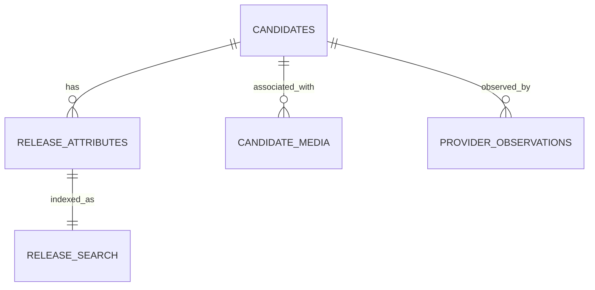

# Data model

**Verified baseline:** 2026-08-21. Implemented tables are described separately from target entities. Target entities do not exist yet.

## Identity vocabulary

### Exact release candidate

The current database key is `(info_hash, file_index_key)`, where `file_index_key = -1` represents a null raw file index.

The target public/logging key is:

$$
\text{releaseKey} = \operatorname{lower}(\text{infoHash}) + ":" +
\begin{cases}
\text{"torrent"} & \text{if fileIndex is null} \\
\text{fileIndex} & \text{otherwise}
\end{cases}
$$

`fileIndex = null` means torrent-level or unknown-file evidence. It never means file zero. Hash grouping may be a presentation feature but must not deduplicate exact candidates.

### Separate target identities

- **Media intent/item:** canonical movie or episode identity.
- **Release candidate:** exact corpus/live evidence identified by `releaseKey`.
- **Provider placement:** provider plus provider-owned resource ID and normalized hash.
- **Provider file:** a file from the provider-authoritative inventory for a placement.
- **Library item:** provider-independent logical media item/edition.
- **Binding:** a versioned mapping from canonical path/item to one validated provider file.

Do not overload one identity with another.

## Current discovery schema

The discovery database uses Node’s `node:sqlite` in WAL mode. `DISCOVERY_DB` selects a file; without it the server uses an in-memory database.

### `candidates`

Exact normalized torrent/file observations.

- Primary key: `(info_hash, file_index_key)`.
- Stores raw `file_index`, release/title/filename, size, swarm/date/link fields, metadata, source references, and first/last-seen timestamps.
- Current ingest merge preserves `first_seen`, updates `last_seen`, overwrites existing scalar fields when a present incoming value is supplied, unions sources, and fills only missing metadata keys.
- This is physical release evidence, not media identity or provider state.

### `release_attributes`

Parser output and release evidence.

- Primary key: `(info_hash, file_index_key, source)`.
- Stores raw filename, parser confidence, title/year/type/episode evidence, quality attributes, language/group, evidence tags, and parse time.
- A later write for the same source unconditionally replaces the stored row, even when its confidence is lower; different parser sources may coexist.
- Parsing evidence is not proof of a media association.

### `candidate_media`

Candidate-to-media associations.

- Primary key: `(info_hash, file_index_key, media_id)`.
- Stores source, confidence, evidence, and association time.
- Associations are currently additive. Weak or incorrect associations have no implemented correction/retraction lifecycle.
- Current search may use the strongest association rather than one matching the selected media.

### `provider_observations`

Latest provider-specific cache observation per exact candidate.

- Primary key: `(info_hash, file_index_key, provider)`.
- Stores nullable `cached`, evidence, and `checked_at`.
- Provider state remains separate from candidates.
- Only the latest value is retained; there is no event history, status/error taxonomy, observation scope, or enforced TTL.
- Ranking currently ignores `checked_at`, so documentation must not claim that observations expire operationally.

### `release_search`

FTS5 copy of searchable release attributes using the `porter unicode61` tokenizer. Insert/update/delete triggers synchronize it with `release_attributes`.

FTS is retrieval evidence only. It is not proof of media identity, desirability, provider state, or fulfillment.

### Current relationships



## Current enforcement gaps

- Exact database identity collapses to info hash during combined merge, React keys, request handoff, and importer request persistence.
- Local retrieval does not require an association to the selected media ID.
- Additive associations can make weak false positives sticky.
- Episode associations can be constructed without validating actual episode existence.
- Provider observations have no freshness/error lifecycle and no append-only history.
- There are no schema versions, migration runner, ingestion run lock, checkpoint lifecycle, or transaction API.
- Root Compose does not persist this database.

## Current physical-import state

`torbox-importer` owns a separate SQLite database and filesystem spool. It persists request/job/provider/Arr state sufficient for crash recovery and guarded physical import, but request identity includes `info_hash` only—not `fileIndex` or `releaseKey`.

The spool directories are:

```text
incoming/ → processing/ → done/
                       ↘ failed/
```

Queue JSON plus importer SQLite are physical-mode implementation details. They must not become the model for virtual desired state.

## Target control-plane entities

These are recommendations, not implemented schema.

### Corpus lifecycle

- `ingest_runs`: run ID, source revision, start/end/status, counts, error.
- `source_fragments`: source path, SHA/ETag, parser version, status, attempts, checkpoint.
- Bounded transaction and WAL checkpoint metadata.

### Release intelligence

- Versioned parser outputs and correctable media associations.
- Conservative release-family relationships with role, confidence, evidence, and version.
- Provider-independent release desirability/explanation.
- Provider-specific cache priors with feature/model version and decision context.

Release desirability, cache prior, and confirmed provider state remain separate fields/concepts.

### Provider observations and placements

- Current provider-observation projection with state (`cached`, `uncached`, `unknown`, `error`), scope, checked/expires time, latency, and error category.
- Append-only provider-observation events with request/batch/check reason.
- Placements with provider resource ID, normalized hash, ownership/provenance, state, timestamps, and failure.
- Provider-authoritative file inventories keyed within a placement, including path/name/size/selection and mapping evidence.
- Mount/exposure observations separate from placement state.

A placement or mount failure never rewrites an authoritative cache result to `uncached`.

### Canonical library

- `library_items`: stable provider-independent media/edition identity and desired state.
- `library_paths`: deterministic user-facing path with uniqueness/collision policy.
- `bindings`: item/path to exact candidate, placement, and provider file; version, status, reason, `validFrom`, optional `supersededAt`, reconciliation time, and failure category.
- `library_events`: requested, checked, placed, exposed, mapped, bound, scanned, playable, degraded, rebound, removed, and failed events.

A canonical path is a logical projection, not proof that bytes, mount, catalog entry, or playback are healthy.

### Outcomes and evaluation

- `fulfillment_outcomes`: request/library item, exact `releaseKey`, family/policy/model versions, provider, placement/binding versions, stages reached, typed terminal outcome, bytes/files, catalog/Arr result, and timestamps.
- Incorrect media, wrong episode, mapping ambiguity, mount failure, Arr rejection, and provider cache results retain distinct labels.
- Never store provider tokens, signed URLs, WebDAV credentials, or sensitive response bodies in telemetry.

## Storage direction

SQLite remains the default for a single-host control plane. Existing corpus-size estimates are contradictory and no whole-corpus reproducible benchmark exists. Do not migrate databases based on estimates alone. Gate any change on measured ingestion throughput, FTS/query latency, write amplification, WAL/backup behavior, contention, and restart recovery.

See [`audit/8-21-audit.md`](audit/8-21-audit.md) for detailed evidence and [`roadmap.md`](roadmap.md) for staged implementation.
