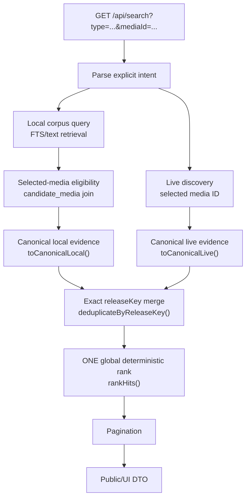
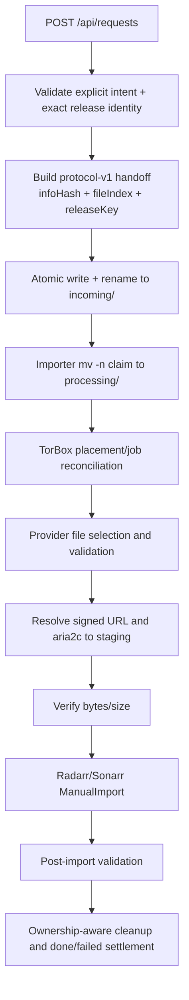

# Pipelines

**Verified baseline:** 2026-08-21. “Current” describes active code. “Target” describes intended behavior not yet implemented.

## Current title and media lookup

```text
UI/client
  → GET /api/search?q=...
  → unified metadata search
  → Cinemeta adapter
  → in-memory TTL/LRU metadata cache
  → normalized media fields
```

`GET /api/media?type=...&id=...` retrieves normalized details from Cinemeta. The active API and UI use `title`, `posterUrl`, `backdropUrl`, `overview`, and numeric `year`.

## Current release discovery



Current consequences:

- Local retrieval is filtered by selected `mediaId` via `candidate_media` join; an empty query returns only candidates explicitly associated with the selected media.
- Identity confidence is scoped to the selected-media association; associations to other media never contribute.
- TV local filters require exact season/episode values and exclude many compatible packs/ranges.
- Only a bounded local set is ranked (explicit limitation: `limit * 2` corpus window).
- Live candidates are normalized to the same canonical evidence shape and enter the global rank.
- Live candidates are exempt from corpus association requirements (no persisted `candidate_media` row needed).
- Exact-key merge preserves all useful provenance; higher-confidence evidence wins per-field.
- Source origin does NOT determine desirability score — evidence does.
- Provider cache hints from Torrentio/Comet remain evidence only, not authoritative observations.
- Deterministic tie-breakers ensure identical input yields identical ordering.
- Result `total` is the post-merge count, not a full-corpus total.

The active unified score is:

$$
S = 0.25R + 0.20Q + 0.20C_r + 0.15C_i + 0.10P + 0.10E
$$

This formula is now a unified system score applied to ALL eligible candidates (local + live) through one ranking path.

## Current DMM ingestion

### API-reachable path

```text
POST /api/ingest/dmm
  → DMMIngestionRunner in the synchronous API process
  → fetch source listing/fragments
  → extract only decompressFromEncodedURIComponent('...') wrapper
  → decode, scan, upsert, then parse attributes
```

Current sampled DMM fragments use an iframe/hash wrapper, so this path fails with `No payload found` before decoding. It has no persistent run state, source revision checkpoint, run lock, retries, or resumability.

### Compatible but unwired path

`media-search/src/lib/ingestion/dmm.js` can extract current iframe/hash fragments, decode them with `lz-string`, parse the complete decoded JSON array, upsert candidates, and parse attributes per record. Tests and manual audit validation exercise it, but no server route, package script, CLI, or container entrypoint calls it.

Neither path is bounded-memory streaming, and neither provides a production corpus lifecycle.

## Current physical fulfillment



The filesystem spool is authoritative for physical-mode ownership. The importer independently validates scope, expected hash/provider ID, selected files, media identity, size, Arr import, and cleanup eligibility.

Current semantics and defects:

- Exact `fileIndex`/`releaseKey` provenance is persisted through queue JSON, status, importer SQLite, and logs. It does not replace provider-authoritative TorBox file inventory or `file_id`.
- Legacy protocol-v1 payloads omitting both fields remain compatible as torrent-level identity; partial exact fields fail validation.
- The worker repeatedly chooses the first `processing` file. A blocked/manual request can starve later work.
- Physical acquisition is TorBox-only and downloads bytes locally before Arr import.

## Current Stage 4 decision foundation

`media-search/src/lib/acquisition/decision.js` provides a pure, unwired decision boundary:

```text
unchanged Stage 3 ranked candidates
  + exact current provider observations
  + ordered provider/account policy targets
  → selected | deferred | unavailable
```

Candidate rank remains primary. A lower-ranked candidate is considered only after every configured target authoritatively reports the higher-ranked candidate `uncached`. Provider preference applies only among fresh authoritative cache hits for the same candidate. Unknown, provider error, stale, unbounded, inferred, predicted, and missing observations defer the decision rather than masquerading as unavailability. Provider and account scopes are isolated. This foundation performs no provider I/O, probing, placement, queue publication, or fulfillment.

## Target discovery and decision pipeline

1. Accept canonical selected media ID, media type, and explicit episode intent.
2. Retrieve local candidates only through an exact association with that selected media.
3. Apply episode-coverage compatibility; keep pack/range evidence explicit.
4. Retrieve live candidates in parallel.
5. Normalize all candidates to one evidence shape with exact `releaseKey`.
6. Apply hard eligibility/rejection before preferences.
7. Deduplicate exact `releaseKey`, never hash or release family.
8. Compute provider-independent release desirability.
9. Compute provider-specific cache priors from information available before probing.
10. Allocate a bounded probe set using desirability, prior, uncertainty, cost, and explicit exploration.
11. Record fresh authoritative provider results as `cached`, `uncached`, `unknown`, or `error` with scope and expiry.
12. Stop probing when policy-defined sufficient desirable cached choices exist.
13. Select placement policy using confirmed state, provider health/cost, existing ownership, and operator policy.
14. Preserve deterministic comparisons and explanations.

Hard eligibility includes selected-media association, explicit episode compatibility, acceptable candidate shape, and policy constraints. Quality, size, seeders, desirability, and predicted cache likelihood are preferences—not identity proof.

## Target virtual fulfillment

```text
intent
  → exact candidate selected
  → authoritative provider check
  → placement reused/created
  → provider ready
  → provider-authoritative file inventory mapped
  → WebDAV exposure observed
  → hidden rclone mount target validated
  → canonical binding atomically published
  → catalog refresh/visibility observed
  → optional playback/open probe
```

Required separate milestones:

```text
requested → checked → placed → provider-ready → exposed
          → exact-file-mapped → bound → cataloged → playable
```

Reconciliation compares desired library state with provider resources, file inventories, WebDAV/mount state, canonical targets, and catalog visibility. It must tolerate eventual consistency: refresh/re-observe before re-place, rebind before duplicate placement, and never delete an unowned resource because a mount is stale.

The Stage 6 repair loop is explicitly phased:

```text
observe scoped evidence
  → plan repair without side effects
  → persist plan
  → explicitly authorize permitted actions
  → execute injected operation(s) in the plan's dependency order
  → require durable gateway idempotency for provider mutation
  → re-observe provider/Zurg/exposure evidence
  → reconcile exact mapping and binding postconditions
```

An operation left `running` across restart has an unknown outcome and is not replayed automatically. Missing exposure permits another mount observation but does not prove provider deletion. Provider resource/file/Zurg IDs and paths remain replaceable observations; the desired `(infoHash,fileIndex)` does not change. Catalog and playback state are outside repair execution and require their own later observations.

## Target physical fallback

The existing queue/importer remains an explicit secondary policy. It receives exact candidate provenance, continues to map against provider-authoritative files, and retains Sonarr/Radarr final import authority. Virtual reconciliation must not be generalized from the importer’s staging/`aria2c`/`ManualImport` lifecycle.

## Error semantics

- Live-source failure may return partial discovery results.
- Provider auth failure opens an operator-visible fault; transient errors remain unknown/error.
- Mount absence does not imply uncached or absent placement.
- Arr rejection may describe media/quality policy, not provider state.
- “Cached,” “placed,” “exposed,” “bound,” “cataloged,” and “playable” are never synonyms.

The current HTTP shapes are documented once in [`../media-search/src/api/API_CONTRACT.md`](../media-search/src/api/API_CONTRACT.md). This file documents flow, not a duplicate API contract.
