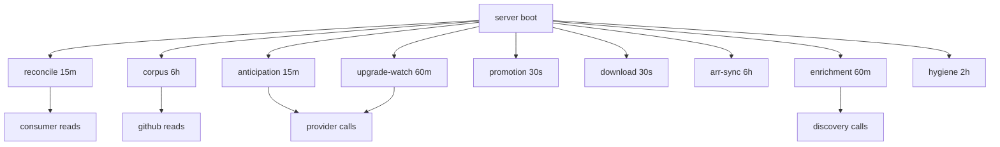

# Background Work and Schedulers

Every timer in `media-search/src/server/index.js` (all `setTimeout`
chains, single-flight; torbox-importer polls separately at
`POLL_INTERVAL`, default 10s). Legitimacy test per timer: required for
correctness, or optional intelligence that must never harm playback.

| Timer | Cadence (default) | Legitimate? | Side effects |
|---|---|---|---|
| Consumer reconcile | 15m (first 60s) | Yes — correctness of published-vs-present truth | Read-only presence checks; auto-retire only if `RETIREMENT_ENABLED` (default OFF) |
| Corpus maintenance | 6h (first 5m) | Yes, bounded — bootstrap + incremental DMM updates | GitHub reads; lifecycle persists last_check so restarts never hammer; failures back off, never destroy serving corpus |
| Anticipation scheduler | 15m (first 2m) | Optional intelligence — one future intent per tick (prepare/publish/prewarm) | Provider + discovery calls; Seerr wake nudges tick to 5s |
| Upgrade watch (+retirement sweep, coverage escalation) | 60m (first 10m) | Optional — re-probe published-below-terminal, one row/tick | Live market probes; retire due temporaries |
| Promotion worker | 30s (first 15s) | Conditional — inert unless `HASHSUCKER_PERMANENT_PATH` set | Owned-storage materialization |
| Download worker (+handoff poll, staged cleanup) | 30s (first 15s) | Conditional — inert unless `HASHSUCKER_DOWNLOAD_PATH` set | Staging, importer-move observation, post-grace sweeps |
| Arr sync | 6h (first 3m) | Optional sensor — absent without RADARR/SONARR_URL | Monitored/upcoming → future intents (reads only) |
| Idle enrichment | hourly (first 15m) | Optional, human-gated — one bounded live query per quiet tick | Discovery only; no acquisition |
| Corpus hygiene | 2h (first 20m) | Yes, bounded — repairs provably-wrong associations only | Mapping-row deletes; releases/TFs/placements never touched |
| Startup readiness summary | once +5s | Yes — diagnostics log, never blocks listen | None |
| Durability V1 repair loop | — | REMOVED (code comments confirm; enroller inert no-op) | None |

Shutdown/restart: timers are in-process; in-flight guards prevent
overlap; corpus lifecycle persists progress so restarts resume rather
than repeat. Deprecated/removed work is deleted, not left dormant —
the V1 repair loop is the template.

## Topology

Every arrow toward providers/consumers is optional, bounded, and
killable via `*_ENABLED=0`. Nothing here is on the playback critical
path.

## Source references

- `media-search/src/server/index.js` (all `arm*Timer`),
  `media-search/src/lib/config/env.js` (env parsing)
