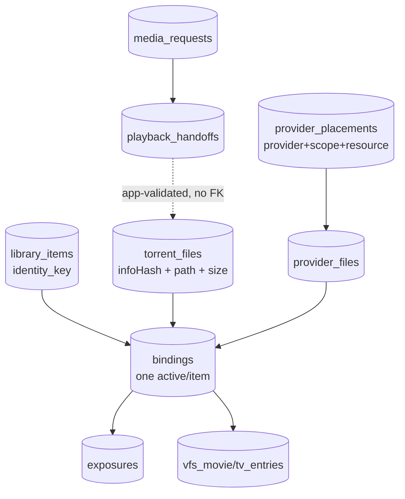

# Internal Contracts and Formats

Real shapes from code. Anything unconfirmed is marked UNKNOWN — do not
treat it as spec.

## Request schemas

`POST /api/media-request` body = `searchByMedia` fields plus
`qualityProfile`, `intent`, `temporary`, `ttlHours`. See
Pipeline-1-Request-Intake for the movie/TV examples. Seerr ingress:
webhook body → `buildSeerrIntent` (TMDB→IMDb resolution, season fan-out
to per-episode children). Download intents: separate `download_requests`
state machine (`lib/download/store.js`), not the playback path.

## Candidate schema

See Pipeline-4-Ranking-Selection for the representative object. Identity
of a candidate row: `(info_hash, file_index_key)` — discovery keys only,
never TorrentFile identity.

## Durable identity schema

`torrent_files`: PK `id` (routing UUID, forensic only),
UNIQUE `(info_hash, internal_path)`, immutable positive size.
`bindings`: partial-unique one-active per item; statuses
active/superseded/degraded/failed; versioned.

## Provider execution contract (Node → Rust)

- Transport: `GET {CONTROL_URL}/data-plane/files/{tfId}` from Rust to
  Node per request (S-1, `schema_version: 1`, 404/empty-coords rejected).
- S-1 body: `torrentFile{id, info_hash, canonical_internal_path, size}`,
  `providers[]` (`provider, account_scope, provider_resource_id,
  provider_file_id, state, size`), optional verified `local{path,size}`.
- Node→Rust serving: path `tfId` + client `Range` + optional
  `x-read-priority`. Provider identity travels inside S-1 coords —
  Rust invents none.
- Rust→client: 206 / 416 / 502 (`PROVIDER_EXHAUSTED` fallback-eligible,
  `S1_FETCH_FAILED` not) / 503+`Retry-After`; serving headers only when
  a provider was used.

## VFS/publication contract (what consumers see)

Canonical paths (`Movies/<Title> (<Year>)/…`,
`TV/<Show>/Season NN/<Show> - SNNENN.mkv`, `[hash10]` on collision);
VFS rows mirror the active Binding's TorrentFile; STRM files are single
resolver-URL lines, never overwritten. Readiness =
binding-active + exposure-visible + mount-configured + path set.

## Playback telemetry / event schema

Rust: 3-layer counters (api/cdn/redirect), `capability_*`,
`recovery_*`, limiter waits vs permit waits, provider-last-throttle,
failovers, `StageClock(T0..T5)` + `StageReport`, cache/decision logs,
`ServingAttribution` (first-reserved snapshot → serving headers).
Node: operator event store (`request_runs`, `lifecycle_events`),
resolver telemetry (`RESOLVER_OUTCOME`), trace formatters. Exact field
lists live in `data-plane/src/metrics.rs` and
`media-search/src/lib/operator/` — summarized here, not duplicated.

## Error/failure classifications

- Discovery: rejection-tracker codes + identity/episode mismatch codes
  (Pipeline-4).
- Providers: `ProviderOperationError` categories
  (auth/authz/rate-limit/timeout/network/not-found/conflict/
  invalid-request/invalid-response/temporarily-unavailable/unsupported/
  unsafe-operation/infringing/unknown) + RD cooldown/resolution errors +
  TorBox file-identity codes.
- Delivery: revalidation outcomes, fallback reasons, TV episode codes,
  terminal delivery states, acquisition decision/collection/execution
  statuses, job-transient-vs-hard classification.

## Source references

- `media-search/src/lib/control-plane/store.js`,
  `media-search/src/lib/discovery/cache.js`,
  `media-search/src/lib/providers/errors.js`
- `data-plane/src/{control,metrics}.rs`
