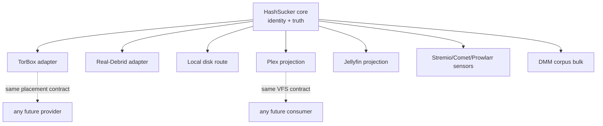

# External Systems and Replaceable Infrastructure

Everything here is tacked on, not intrinsic. Classification matters
because HashSucker's architecture treats providers/consumers as
replaceable — this page records what that claim concretely means.

Legend: **required** / **optional** / **compat-adapter** / **provider** /
**consumer** / **metadata-source** / **test-harness**.

## Providers (execution infrastructure, never identity)

| System | Class | Contract expected | If removed | Owns canonical state? |
|---|---|---|---|---|
| TorBox | provider, core | checkcached/inventory/placement/CDN URLs; honors 429+Retry-After | Routes via TorBox die; RD/local remain | No |
| Real-Debrid | provider, core | Bounded listing, magnet/info/select/unrestrict; 60s cooldown, 1 retry | Routes via RD die | No |
| Local disk (`LOCAL_ROOT`, permanent path) | provider-route, optional | Regular files, exact size, containment | No local route; nothing else changes | No (bytes only) |

Either provider alone works. Both are swappable: replacement means a new
adapter speaking placement/observation/capability, zero identity changes.

## Consumers (projections, never home)

| System | Class | Contract expected | If removed | Owns canonical state? |
|---|---|---|---|---|
| Plex | consumer, core | Library sections, episode visibility (`Media[].Part[]`), sessions (retention), refresh API | No Plex projection; library truth untouched | No (its DB is its own) |
| Jellyfin | consumer, core | Library refresh, STRM playback, listing | Same as Plex | No |
| torbox-importer + Arr import | compat-adapter | Filesystem queue + outbox manifests + consumer ACKs | No staged-file ingestion path | No |
| Infuse/Kodi via WebDAV/STRM | consumer, incidental | Standard file/URL reads | Nothing internal changes | No |

Plex IDs (ratingKey/Part) are explicitly non-canonical. Scanner quirks
(stuck scans) are worked around, never modeled as truth.

## Discovery/metadata sources (sensors, never authority)

Torrentio/Comet-class Stremio manifests, Prowlarr/Jackett/Torznab
indexers, DMM corpus bulk ingest, Cinemeta metadata (7d cache): all
outbound clients. Live observations can confirm; stored rows can only
suggest. Remove any subset: narrower candidate pools, same pipeline.

## Request ingress (external intent, internal normalization)

Seerr/Overseerr/Jellyseerr webhooks (bearer token), Requestrr mentions
in code as a generic external intent source (wiring unconfirmed —
UNKNOWN whether a live integration exists), Sonarr/Radarr monitored/
upcoming as read-only sensors (never downloads). No served
Stremio-addon manifest or Torznab-server routes exist (client/normalize
only).

## Infrastructure (replaceable by design)

SQLite (`node:sqlite`, WAL): two Node DBs (discovery-cache,
control-plane) + Rust chunk store. Swappable storage with the same
contracts; owns no truth beyond what the schemas above define. Caddy
(`edge/`): transparent streaming hop, strips internal headers, sets no
content headers — any byte-transparent reverse proxy qualifies.
Compose services/ports: media-search `:3000` (host-loopback), data-plane
`:3001` (internal), edge `:8080` (public), torbox-importer (no listener).

## Test harness only

Canary fixtures, CDP environment, benchmark drivers (`scripts/`,
`data-plane/bench/*.mjs`), scratch DB copies. Never production paths.

## Replaceability model

Swapping a provider means implementing placement/observation/capability
against the existing contracts — identity rows don't move. Swapping a
consumer means projecting the same VFS truth elsewhere. Sensors are
additive: removing one narrows candidate pools, never breaks the pipeline.

## Source references

- `media-search/src/lib/stremio/`, `media-search/src/lib/torznab/`,
  `media-search/src/lib/discovery/prowlarr.js`
- `media-search/src/lib/consumers/`, `media-search/src/lib/plex/`
- `torbox-importer/`, `edge/Caddyfile`, `compose.yaml`
