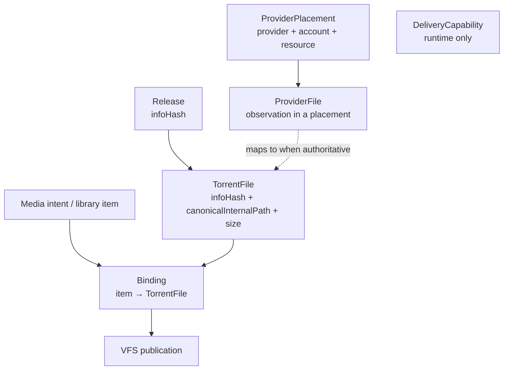

# Durable Identity Model

The single most important page in this wiki. Almost every architectural
decision in HashSucker is a consequence of this model. Canonical:
`docs/architecture.md` §2, `AGENTS.override.md` (Durable identity).

## The grains (coexist, never collapse)

| Entity | Durable meaning | Example |
|---|---|---|
| Release | `infoHash` | `d0...9f` (40 hex) |
| TorrentFile | `(infoHash, canonicalInternalPath)` + immutable positive size | `d0...9f` + `Show.S01E01.1080p.mkv` + `2147483648` |
| `torrent_files.id` | Routing UUID / forensic label only | `tf_426aa723-...` — never byte identity |
| ProviderPlacement | `(provider, accountScope, providerResourceId)`; `infoHash` immutable for that key | `(torbox, default, 123456)` |
| ProviderFile | Current file observation inside a placement; maps to a TorrentFile when authoritative | TorBox file listing row |
| MediaBinding | Library item/path → release, placement, ProviderFile; read-only exposure | VFS row for Lanterns S01E01 |
| DeliveryCapability | Private Rust runtime state (ephemeral signed URL) | Never persisted, never identity |

## What survives provider replacement

Everything left of ProviderPlacement: intent, Release, TorrentFile,
Binding, publication. What changes: which placement serves, which
capability URL is live. This is why Real-Debrid's May-2026 keyword
filter was survivable in principle — filtered routes die, objects don't.

## What does NOT define identity (never)

Basename, provider filename, file ordinal/index, `releaseKey`, Comet
fields, capability URLs, CDN URLs, unscoped `providerResourceId`,
mount/VFS paths, Plex ratingKeys, surrogate UUIDs. Each has caused a
real bug or near-miss historically; the override file lists them as a
blocklist, not guidance.

## The byte-identity invariant

The same exact Range of the same TorrentFile must be byte-identical on
TorBox and Real-Debrid. Different bytes for one TorrentFile is an
identity violation, not a provider quirk. Rust's cache/coalescing key
includes size for exactly this reason.

## TorrentFile vs releaseKey vs fileIndex

`releaseKey` (`infoHash:fileIndex`) and `file_index_key` are discovery
candidate keys — useful for deduping search results, meaningless as
durable identity. File ordinals shift when a torrent is re-listed;
canonical internal paths don't. This distinction is the most common
source of identity bugs; respect it.

## Source references

- `docs/architecture.md` §2 (Identity), §5 (Invariants)
- `AGENTS.override.md` (Durable identity)
- `media-search/src/lib/control-plane/canonical-path.js`
- `media-search/src/lib/control-plane/store.js` (bindings, placements)
