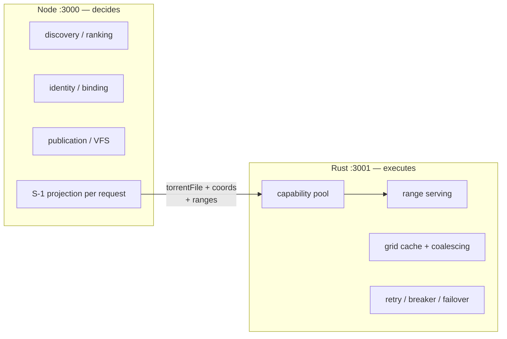

# Node vs Rust Responsibility Boundary

The authority boundary is the load-bearing wall of the system. Node
(`media-search`, JS) owns durable truth; Rust (`data-plane`) owns byte
motion. Crossing it in either direction is a defect, not a shortcut.

## Node owns (durable)

Release/TorrentFile/Binding semantics, discovery and ranking, persisted
candidates, publication and VFS rows, consumer refresh, and — critically —
**selecting another TorrentFile or Release**, allowed only after the
authoritative VFS path receives classified provider exhaustion. Node
never serves a byte.

## Rust owns (runtime)

DeliveryCapability lifecycle, TorBox/Real-Debrid Range delivery,
retry/`Retry-After` handling, limiter/breaker behavior, same-TorrentFile
provider recovery, fixed-grid cache, request coalescing, scheduling.
Rust may switch providers **only for the same exact TorrentFile**. Rust
never discovers, never ranks, never substitutes another TorrentFile or
Release, never reads SQLite, never persists identity. These prohibitions
are encoded in code comments and error semantics (`S1_FETCH_FAILED`
never falls through to unrelated candidates; `PROVIDER_EXHAUSTED` is the
sole fallback-eligible error), not just docs.

## The S-1 contract (the only thing that crosses)

Per request, Node projects exactly one TorrentFile plus its serving
coordinates to Rust (`GET {CONTROL_URL}/data-plane/files/{tfId}`,
`schema_version: 1`). Rust fetches this projection fresh per request —
it trusts nothing carried over from prior requests. Rejects: wrong
schema, 404, empty coordinates, bad local paths.

## Why the wall exists

Durable decisions need transactions, history, and policy (SQLite, slow,
careful). Byte delivery needs zero-copy ranges, coalescing, and
microsecond discipline (no database, no discovery). Mixing them produced
every historical identity bug: provider URLs persisted as truth, ordinals
keying bytes, capabilities outliving their placements. The wall makes
those bug classes structurally impossible instead of merely forbidden.

## Source references

- `docs/architecture.md` §§1,4 (services, HTTP surface)
- `data-plane/src/control.rs`, `data-plane/src/lib.rs:17-20`
- `data-plane/src/manager.rs`, `data-plane/src/serve.rs`
