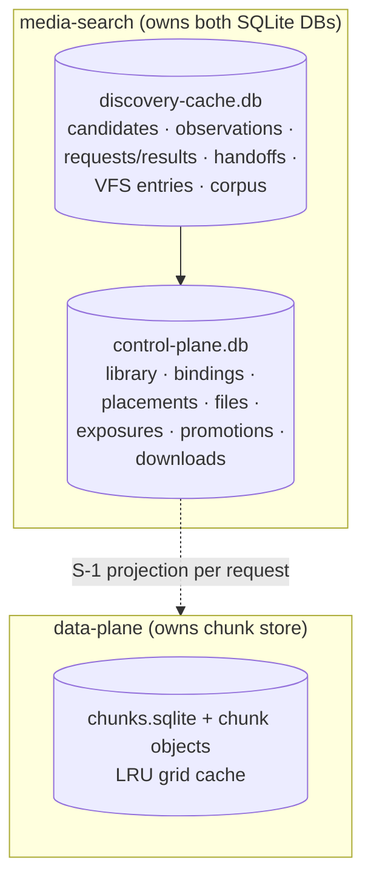

# State and Persistence

Three durable stores, three owners. Everything else is runtime.

## Discovery-cache DB (owner: `lib/discovery/cache.js` + satellites)

Candidate/observation/request truth: `candidates`,
`provider_observations` + event log + current projection,
`evidence_observations/_query`, `candidate_media`,
`release_attributes` + FTS `release_search`, `media_intents`,
`media_requests`, `media_request_results`, `playback_handoffs`
(+ app-validated `torrent_file_id`), `vfs_movie/tv_entries`
(canonical path UNIQUE, TF id, **no provider URLs**),
`historical_provider_evidence[_sightings]` (prior, not current),
`rd_download_observations/correlations` (raw log + hypothesis cache,
not authoritative). Satellite tables on the same handle:
`future_intents`, `arr_sync_state`, `upgrade_watch`,
`search_decisions`, corpus generation/fragment/state/quarantine
tables, `media_metadata`, `seerr_availability_wakes`,
`hygiene_repairs`, operator `request_runs`/`lifecycle_events`.
Restart semantics: plain SQLite; migrations ledgered; scratch copies
for harnesses, never mutate live for convenience.

## Control-plane DB (owner: `lib/control-plane/store.js`)

Library truth: `library_items` (identity key unique), `library_paths`
(one active canonical path), `provider_placements` (state machine),
`provider_placement_observations`, `provider_readiness_observations`,
`torrent_files` (exact-object identity), `provider_files`
(mapped/unmapped/incomplete/conflict), `provider_inventory_snapshots`,
`candidate_file_mappings`, `exposures`, `bindings` (one active/item,
versioned), `repair_transactions/_steps`, per-item `lifecycle_events`,
`provider_delivery_evidence`, `consumer_observations`,
`promotions` (owned storage), `download_requests` (staging).
Relationships: bindings → torrent_files; provider_files →
torrent_files; exposures/bindings reference placements + files.

## Rust chunk store (owner: `data-plane/src/cache.rs`)

`chunks.sqlite` (`chunks`, `meta`) + `cache/<sha256>/<idx>.chunk`
objects on the `hy4-cache` volume. Survives restart (complete chunks +
LRU order); in-flight, pools, metrics, lane state do not. Format/grid
change resets the store.

## Runtime-only (never persisted)

DeliveryCapability pool/permits/limiters/breakers/neg-cache,
`mylist` snapshots, CDN URLs, `providerState` in handoffs, live
discovery hints, in-flight coalescing records, prefetch/playback-intel
maps, per-request coordinators.

## Torbox-importer DB

Separate small DB (`jobs`, `files`, `events`, `requests`) owned by
`torbox-importer/scripts/db-init.sh` — queue bookkeeping only.

## Source references

- `media-search/src/lib/discovery/cache.js` (SCHEMA + consts),
  `media-search/src/lib/control-plane/store.js`,
  `media-search/src/lib/download/store.js`,
  `media-search/src/lib/promotion/store.js`
- `data-plane/src/cache.rs`, `torbox-importer/scripts/db-init.sh`
