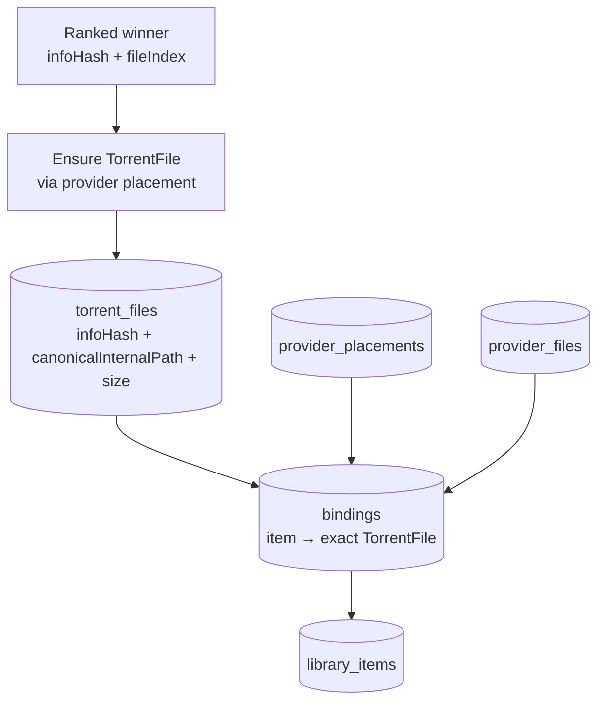

# Stage 5 — Durable Identity Creation

The moment a ranked winner becomes something the household can keep.
Only Node creates durable identity, and only through authoritative
provider placement/inventory — never from filenames, ordinals, or
provider-native labels.

## Objects and when they become durable

| Object | Identity | Created when | Mutated by |
|---|---|---|---|
| Release | `infoHash` | First observation of the hash | Never (immutable) |
| TorrentFile | `infoHash` + `canonicalInternalPath` + exact positive `size` | Binding path resolves exactly one playable file through placement inventory | Never (immutable; conflicts throw) |
| ProviderPlacement | `(provider, accountScope, providerResourceId)` | Placement created/observed (`pending/ready/degraded/error/removed/unknown`) | State machine on observations |
| ProviderFile | `(placement, provider_file_id)` → mapped to TorrentFile | Inventory snapshot mapping | Re-mapping on inventory change |
| Binding | one active per library item (partial unique) | `activateBinding`: item + TorrentFile + placement + provider file + exposure | Supersede/degrade/fail versioned transitions |
| LibraryItem | `identity_key` (`movie:<id>:default`, `episode:<id>:default:S:E`) | `ensureLibraryItem` (desired_state, publication_mode, profile, intent) | Intent/profile/retirement updates |
| LibraryPath | one active canonical path per item | `ensureCanonicalPath` (+ deterministic `[hash10]` collision suffix) | Collision handling only |
| Exposure | `(transport, key, placement, file)` | `recordExposure` (mount/transport visibility) | Visibility state |

## Rules that are load-bearing

- Discovery/ranking evidence selects candidates; it does **not** define
  physical identity (`media-search/AGENTS.override.md`).
- TV episodes bind only on exactly one playable file; zero or multiple
  matches continue through ranked candidates instead of inventing identity.
- New VFS publication must reference `torrent_file_id` with TorrentFile
  truth for path and size. Legacy `NULL` rows supersede, never author.
- Stale provider state never redefines a TorrentFile; delivery
  capabilities and provider URLs never become persisted identity.

## Source references

- `media-search/src/lib/control-plane/store.js` (tables),
  `media-search/src/lib/control-plane/canonical-path.js`,
  `media-search/src/lib/vfs/materialize.js`,
  `media-search/src/lib/resolver/torbox-file-identity.js`
