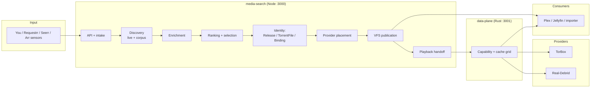

# Pipeline Overview — Request to Playback

Canonical behavior: `src/PRODUCTION-PLAYBACK-TESTING.md`, `docs/architecture.md`.
Code references below are entry points, not copies.

## Stage map

| # | Stage | Wiki page | Core question it answers |
|---|---|---|---|
| 1 | Request intake | Pipeline-1-Request-Intake | What was asked, in what shape? |
| 2 | Discovery | Pipeline-2-Discovery | What releases exist for it? |
| 3 | Enrichment | Pipeline-3-Enrichment | What do we know about each candidate? |
| 4 | Ranking + selection | Pipeline-4-Ranking-Selection | Which exact file wins, and why not the others? |
| 5 | Identity + binding | Pipeline-5-Identity-Binding | What durable objects now exist? |
| 6 | Placement + providers | Pipeline-6-Placement-Providers | Where do the bytes live right now? |
| 7 | Publication / VFS | Pipeline-7-Publication-VFS | What does the consumer see? |
| 8 | Playback handoff | Pipeline-8-Playback-Handoff | What authority crosses into byte serving? |
| 9 | Data-plane execution | Pipeline-9-Data-Plane | How are exact bytes delivered? |
| 10 | Return path | Pipeline-10-Return-Path | What does the player experience? |

## Two truths that govern every stage

1. **Live discovery is authoritative per request; the corpus is advisory.** Stored candidates accelerate ranking but never override what providers report now.
2. **Only Node creates durable identity; only Rust moves bytes.** Rust never discovers, ranks, substitutes a TorrentFile, or reads SQLite. Node never serves a byte.

## Source references

- Entry: `media-search/src/server/app.js`, `media-search/src/api/media-request.js`
- Execution: `data-plane/src/main.rs`, `data-plane/src/serve.rs`, `data-plane/src/control.rs`
- Identity model: `docs/architecture.md` §2, `media-search/src/lib/control-plane/canonical-path.js`
