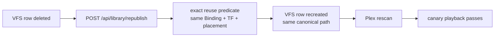

# Plex Integration

Plex is the primary proven consumer: library surface, playback client
(via the canary HTPC), and session source. Plex owns its database,
sessions, and IDs; HashSucker owns which exact bytes those IDs resolve
to. Neither side reaches into the other.

## Library visibility

HashSucker publishes canonical VFS paths; Plex scans them like any
library. Episode confirmation reads `Media[].Part[]` (`ratingKey →
consumerItemId`, e.g. Lanterns S01E01 = ratingKey `497`, Part `1042`).
Reachability or token failures park as fail-closed UNKNOWN — a Plex
that can't be reached is never treated as an absent library.

## Scanner expectations

Plex expects stable filesystem paths and valid media probes. Canonical
paths never change for a TorrentFile; supersede preserves the path
while swapping the binding underneath. Refresh is coalesced per
`(sectionId, scanPath, collection)` (~750ms debounce,
`refresh-coalescer.js`): partial-refresh only, never escalated to a
full-section scan on failure. Season fan-out scope coalesces notify
bursts so one season doesn't stampede the scanner.

## ratingKey / Part relationship

`ratingKey` identifies PMS's metadata row; `Part` identifies the file
it scanned. Both are PMS-owned observations. The binding points at the
TorrentFile; the Part is evidence the consumer sees it, nothing more.
Playback acceptance requires PMS session state **plus** HashSucker read
attribution — Part visibility alone never counts (see Testing-Canary).

## PMS sessions

Active sessions feed temporary-publication retention
(`plex-sessions.js`): real playback sessions are the retention signal,
not wall-clock age. Session absence never unpublishes by itself.

## HTPC and the canary

Production playback proof drives the official Plex HTPC for Linux on an
isolated display (`:86`) and audio sink, controlled over loopback CDP
(`127.0.0.1:9222`), host-namespace only. PMS control stays private-LAN;
no relay or proxy is permitted. The canary never restarts PMS,
providers, or product state — it plays and observes.

## Reconstruction limits

Republication recreates the VFS/publication truth; Plex re-discovers it
by scanning. Proven: single-item E01 removal → republish → Plex-visible
→ playback. Not proven: whole-library rebuild timing, Plex→Jellyfin
state migration, watched-state survival. Those are separate gates, not
implied by republication.

## Reconstruction (proven, bounded)

E01 proven end to end: publication genuinely removed, recreated with
identical Binding/TorrentFile/placement/representation/path, no
discovery or reselection, playback passed. Missing retained truth
returns 409 fail-closed. This is republication of one item — not whole-
library rebuild, not migration, not watched-state survival.

## What Plex owns vs HashSucker owns

| Plex owns | HashSucker owns |
|---|---|
| Metadata rows, ratingKeys, Parts | TorrentFile, Binding, placement |
| Sessions, watch state, resume | Retention signals derived from sessions |
| Scan scheduling, client apps | Canonical paths, refresh notifications |
| Tokens, access control | Nothing about Plex auth |

## Source references

- `media-search/src/lib/consumers/plex.js`,
  `media-search/src/lib/consumers/plex-sessions.js`,
  `media-search/src/lib/plex/refresh-coalescer.js`
- `media-search/src/lib/requests/plex-notifier.js`
- `src/PRODUCTION-PLAYBACK-TESTING.md` (canary mechanics)
